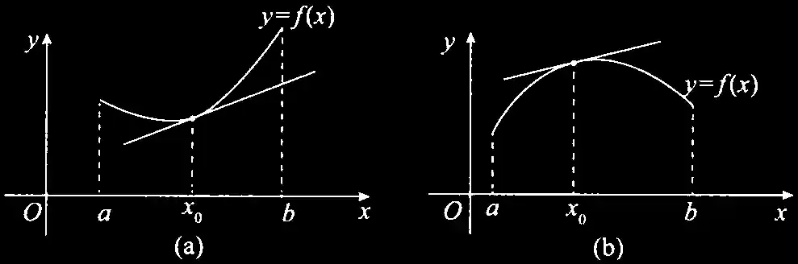

# 第5讲 一元函数微分学的应用（一）几何应用

## 一、极值的定义

对于函数 $f(x)$ ,若存在点 $x_0$ 的某个邻域，使得在该邻域内任意一点 $x$ ,均有

$$f(x)\leqslant f(x_0)(\text{或 }f(x)\geqslant f(x_0))$$

成立，则称点 $x_0$ 为 $f(x)$ 的极大值点(或极小值点), $f(x_0)$ 为 $f(x)$ 的极大值(或极小值).

> 间断点可以是极值点

## 二、单调性与极值的判别

### 1. 单调性的判别

设函数$y=f(x)$在$[a,b]$上连续，在$(a,b)$内可导.

1. 如果在 $(a,b)$ 内 $f^{\prime}(x)\geqslant0$ ,且等号仅在有限个点处成立，那么函数 $y=f(x)$在 $[a,b]$ 上严格单调增加；
2. 如果在 $(a,b)$ 内 $f^{\prime}(x)\leqslant0$ ,且等号仅在有限个点处成立，那么函数 $y=f(x)$在 $[a,b]$ 上严格单调减少.

### 2. 一阶可导点是极值点的必要条件

设 $f(x)$ 在 $x=x_0$ 处可导，且在点 $x_0$ 处取得极值，则必有 $f^\prime(x_0)=0.$

> 【注】事实上，若$x=x_0$为曲线$y=f(x)$的极值点，则只有以下两种情况：
>
> - $f^\prime(x_0)=0$  
> - $f^{\prime}\left(x_{0}\right)不存在$

### 3. 判别极值的第一充分条件

设$f(x)$在$x=x_0$处连续，且在$x_0$的某去心邻域$U(x_0,\delta)(\delta>0)$内可导.

- 若 $x\in(x_0-\delta,x_0)$ 时， $f^\prime(x)<0$ ,而 $x\in(x_0,x_0+\delta)$ 时 $,f^\prime(x)>0$,则 $f(x)$ 在 $x=x_0$ 处取得极小值；
- 若 $x\in(x_0-\delta,x_{0})$ 时， $f^\prime(x)>0$ ,而 $x\in(x_0,x_{0}+\delta)$ 时 $,f^\prime(x)<0$,则 $f(x)$ 在 $x=x_0$ 处取得极大值；
- 若 $f^\prime(x)$ 在 $(x_0-\delta,x_0)$ 和 $(x_0,x_0+\delta)$ 内不变号，则点 $x_0$ 不是极值点.

### 4. 判别极值的第二充分条件

设 $f(x) $在 $x=x_0$ 处二阶可导，且 $f^\prime(x_0)=0,f^{\prime\prime}(x_0)\neq0.$

- 若 $f^{\prime\prime}(x_0)<0,则f(x)$ 在 $x_0$处取得极大值；
- 若 $f^{\prime\prime}(x_{0})>0,则f(x)$ 在 $x_0$处取得极小值.

上述第二充分条件可以推广为第三充分条件.

### 5. 判别极值的第三充分条件

设$f(x)$在$x=x_0$处$n$阶可导，且$f^{(m)}(x_0)=0(m=1,2,\cdots,n-1),f^{(n)}(x_0)\neq0(n\geqslant2)$,则

- 当 $n$ 为偶数且 $f^{(n)}(x_0)<0$时，$f(x)$ 在 $x_0$ 处取得极大值；
- 当 $n$ 为偶数且 $f^{(n)}(x_0)>0$ 时 $f(x)$ 在 $x_0$ 处取得极小值

## 三、四凸性与拐点的概念

### 1. 凹凸性的定义

#### 定义 1

设函数$f(x)$在区间$I$上连续.如果对$I$上任意不同两点$x_1,x_2$,恒有

$$f\Bigg(\frac{x_1+x_2}{2}\Bigg)<\frac{f(x_1)+f(x_2)}{2}\:,$$

则称 $y=f(x)$在$I$ 上的图形是凹的(或凹弧)；如果恒有

$$f\Bigg(\frac{x_1+x_2}{2}\Bigg)>\frac{f(x_1)+f(x_2)}{2}\:,$$

则称$y=f(x)$在$I$上的图形是凸的(或凸弧).

> 【注】事实上, 当图形为凹时,可以将 $f\left( \frac 12x_{1}+ \frac 12x_{2}\right ) < \frac 12f\left ( x_{1}\right ) + \frac 12f\left ( x_{2}\right )$更一般地写为
> $$f(\lambda_{1}x_{1}+\lambda_{2}x_{2})<\lambda_{1}f(x_{1})+\lambda_{2}f(x_{2})\:,\:\text{其中}\:0<\lambda_{1}<1,\:0<\lambda_{2}<1,\:\lambda_{1}+\lambda_{2}=1\:.$$

#### 定义 2

设$f(x)$在$[a,b]$上连续，在$(a,b)$内可导，若对$(a,b)$内的任意$x$及$x_0(x\neq x_0)$,均有

$$
\begin{align*}
f(x_0)+f'(x_0)(x-x_0) &<f(x)\:,\\
&>&
\end{align*}
$$

则称$f(x)$在$[a,b]$的图形上是凹(凸)的.

> 【注】(几何意义)  
> $y=f(x_{0})+f^{\prime} (x_{0})(x-x_{0})$ 是曲线 $y=f(x)$ 在点 $(x_{0},f(x_{0}))$ 处的切线方程，因此上式的几何意义如图 5-3 所示 .  
> 若曲线 $y=f(x)(a<x<b)$ 在任意点处的切线(除该点外)总在曲线的下方(上方),则该曲线是凹(凸)的。  
>   
> 图 5-3

### 2. 拐点的定义

连续曲线的凹弧与凸弧的分界点称为该曲线的拐点。

- 拐点处只需连续
- 判别拐点时凹凸不分先后
- 拐点在曲线上,写 $\left(x_0,f(x_0)\right)$

## 四、凹凸性与拐点的判别

### 1. 判别凹凸性

设函数 $f(x)$ 在 $I$上二阶可导 .

- 若在 $I$ 上 $f^{\prime\prime}(x)>0$ ,则 $f(x)$ 在 $I$ 上的 **图形是凹的** ；
- 若在 $I$ 上 $f^{\prime\prime}(x)<0$ ,则 $f(x)$ 在 $I$ 上的 **图形是凸的** .

### 2. 二阶可导点是拐点的必要条件

设$f^{\prime\prime}(x_0)$存在，且点$(x_0,f(x_0))$为曲线的拐点，则$f^{\prime\prime}(x_0)=0.$

> **【注】** 事实上，若点$\left(x_0,f\left(x_0\right)\right)$为曲线$y=f\left(x\right)$的拐点，则只有以下两种情况：
>
> - $f^{\prime\prime}\left(x_{0}\right)=0$ ,如 $y=x^{3}$ 在 $\left(0,0\right)$ 处的情形
> - $f^{\prime\prime}\left(x_{0}\right)$ 不存在。

### 3. 判别拐点的第一充分条件

设 $f(x)$ 在点$x=x_0$处连续，在点 $x=x_0$ 的某去心邻域 $U(x_0,\delta)$ 内二阶导数存在，且在该点的左、右
邻域内 $f^{\prime\prime}(x)$变号 (无论是由正变负，还是由负变正 ),则点 $(x_0,f(x_0))$为曲线的拐点 .

> **【注】** $(x_0,f(x_0))$ 为曲线 $y=f(x)$ 的拐点，并不要求 $f(x)$ 在点 $x_0$ 的导数存在。  
> 如 $y=\sqrt[3]{x}$在$x=0$的情形，其中$y^\prime=\frac13x^{-\frac23},y^{\prime\prime}=-\frac29x^{-\frac53}$,
> 当$x>0$时，$y^{\prime\prime}<0;$当$x<0$时，$y^\prime>0$,故点(0,0)为曲线$y=\sqrt[3]{x}$的拐点，但在该点的导数不存在。

### 4. 判别拐点的第二充分条件

设$f(x)$在$x=x_0$的某邻域内三阶可导，且 $f^{\prime\prime}(x_0)=0,f^{\prime\prime\prime}(x_0)\neq0$ ,则点$(x_0,f(x_0))$为曲线的拐点.

### 5. 判别拐点的第三充分条件

设$f(x)$在$x_0$处$n$阶可导，且$f^{(m)}(x_0)=0(m=2,\cdots,n-1),f^{(n)}(x_0)\neq0(n\geqslant3)$,则当$n$为奇数时，点
$(x_0,f(x_0))$为曲线的拐点 .

## 五、极值点与拐点的重要结论

以下结论均可直接使用，不必证明.

- 曲线的可导点不可同时为极值点和拐点；曲线的不可导点可同时为极值点和拐点.
- 设多项式函数 $f(x)=(x-a)^ng(x)(n>1)$ ,且 $g(a)\neq0$ ,则当 $n$ 为偶数时，$x=a$ 是 $f(x)$ 的极值点；
当 $n$ 为奇数时，点 $(a,0)$ 是曲线 $f(x)$ 的拐点 .
- 设多项式函数 $f(x)=(x-a_1)^{n_1}(x-a_2)^{n_2}\cdots(x-a_k)^{n_k}$,其中$n_i$是正整数，$a_i$是实数且$a_i$两两不等，$i= 1, 2, \cdots , k$ .  
    记 $k_1$ 为 $n_i=1$ 的个数，$k_2$为 $n_i>1$ 且 $n_i$ 为偶数的个数，$k_3$ 为 $n_i>1$ 且 $n_i$ 为奇数的个数，则 $f(x)$ 的极值点个数为 $k_1+2k_2+k_3-1$ ,拐点个数为 $k_1+2k_2+3k_3-2.$

## 六、渐近线

### 1. 铅直渐近线

若 $\mathop{\lim }\limits_{x\to x_0^+}f(x)=\infty$ （或 $\mathop{\lim}\limits_{x\to {x}_0^-}f(x)=\infty$ ）,则 $x=x_0$ 为一条铅直渐近线

> 【注】此处的 $x_{0} $或是函数的无定义点，或是函数定义区间的端点，或是分段函数的分段点 .

### 2. 水平渐近线

若 $\mathop{\lim }\limits_{x\to+\infty} f(x)=y_1$, 则$y=y_1$ 为一条水平渐近线 ;若$\mathop{\lim }\limits_{x\to-\infty} f(x)=y_2$, 则$y=y_2$ 为一条水平渐近线；

若 $\mathop{\lim }\limits_{x\to+\infty}f(x)=\mathop{\lim }\limits_{x\to-\infty}f(x)=y_{0}$ ，则 $y=y_{0}$ 为一条水平渐近线

### 3. 斜渐近线

若 $\mathop{\lim }\limits_{x\to+\infty}\displaystyle\frac{f(x)}x=a_{1}(a_{1}\neq0),\mathop{\lim }\limits_{x\to+\infty}\left[f(x)-a_{1}x\right]=b_{1}$ ,则 $y=a_1x+b_{1}$ 是曲线 $y=f(x)$ 的一条斜渐近线

若 $\mathop{\lim }\limits_{x\to-\infty}\displaystyle\frac{f(x)}x=a_{2}(a_{2}\neq0),\mathop{\lim }\limits_{x\to-\infty}\left[f(x)-a_{2}x\right]=b_{2}$ ,则 $y=a_2x+b_{2}$ 是曲线 $y=f(x)$ 的一条斜渐近线

若 $\mathop{\lim }\limits_{x\to+\infty}\displaystyle\frac{f(x)}{x}=\mathop{\lim }\limits_{x\to-\infty}\frac{f(x)}{x}=a(a\neq0)$ , $\quad\mathop{\lim }\limits_{x\to+\infty}\left[f(x)-ax\right]=\mathop{\lim }\limits_{x\to-\infty}\left[f(x)-ax\right]=b ,$ 则 $y=ax+b\text{是曲线}y=f(x)$
的一条斜渐近线.

> 【注】 寻找渐近线的顺序：铅直渐近线、水平渐近线、斜渐近线。

## 七、最值或取值范围

### 1. 最值的定义

#### 定义 3

设 $x_0$ 为 $f(x)$ 定义域内一点，若对于 $f(x)$ 的定义域内任意一点 $x$,均有

$$f(x)\leqslant f(x_0)(\text{或}f(x)\geqslant f(x_0))$$

成立，则称$f(x_0)$为$f(x)$的最大值(或最小值).

> 【注】
>
> - 极值点并不一定是最值点，最值点也不一定是极值点 .
> - 如果$f(x)$在区间$I$上有最值点 $x_0$,并且此最值点 $x_0$ 不是区间 $I$ 的端点而是 $I$ 内部的点，那么此 $x_0$ 必是$f\left(x\right)$的一个极值点

### 2. 求区间 $[a,b]$ 上连续函数 $f(x)$ 的最大值 $M$ 和最小值 $m$

1. 在$(a,b)$内的可疑点——驻点与不可导点，并求出这些可疑点处的函数值；
2. 求出端点的函数值$f(a)$和$f(b);$
3. 比较以上所求得的所有函数值，其中最大者为 $f(x)$ 在 $[a,b]$上的最大值$M$,最小者为 $f(x)$在 $[a,b]$ 上的最小值 $m$ .

> 【注】 有时这类问题也可命制为 “求连续函数 $f(x)$ 在区间 $[a,b]$ 上的值域 $[m,M]$”

### 3. 求区间 $(a,b)$ 内连续函数 $f(x)$ 的最值或取值范围

1. 求出 $f(x)$ 在 $(a,b)$ 内的可疑点——驻点与不可导点，并求出这些可疑点处的函数值;
2. 求$(a,b)$两端的单侧极限：  
    若$a,b$ 为有限常数，则求 $\mathop{\lim }\limits_{x\to a^+}f(x)$ 与 $\mathop{\lim }\limits_{x\to b^-} f(x)$;  
    若 $a$ 为 $-\infty$ ,则求 $\mathop{\lim }\limits_{x\to - \infty}f(x);$  
    若 $b$ 为 $+\infty$ ,则求 $\mathop{\lim }\limits_{x\to+\infty}f(x).$ 记以上所求左端极限为$A$,右端极限为$B;$
3. 比较 1. 2. 所得结果，确定最值或取值范围.

## 八、作函数图像

### (1) 给出函数$f(x)$,作图的一般步骤

1. 确定定义域，考查函数是否有奇偶性，周期性，并用好图像变换；

2. 用导数工具(一阶导数确定函数的单调区间、极值点；二阶导数确定曲线的凹凸区间、拐点);

3. 考查渐近线；

4. 作出函数图像.

这是基本功，一定要重视.

### (2) 给出参数方程

a. 描点法

b. 化为 $\begin{cases}\text{直角坐标方程}\\\text{极坐标方程}\end{cases}$

如$\begin{cases}x=\sin t,\\y=\cos^3t\end{cases}(0\leqslant t\leqslant2\pi)$化为直角坐标方程为$y^2=(1-x^2)^3$

## 九、曲率及曲率半径(仅数学一、数学二 )

设 $y(x)$二阶可导，则曲线$y=y(x)$在点$(x,y(x))$处的曲率公式为
$$k=\frac{|y^{\prime\prime}|}{[1+(y^{\prime})^2]^{\frac{3}{2}}}\:.$$

曲率半径的计算公式

$$R=\frac{1}{k}=\frac{\begin{bmatrix}1+(y')^2\end{bmatrix}^{\frac{3}{2}}}{\begin{vmatrix}y''\end{vmatrix}}(y''\neq0)\:.$$
