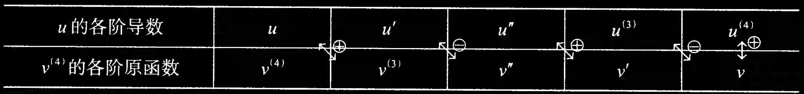
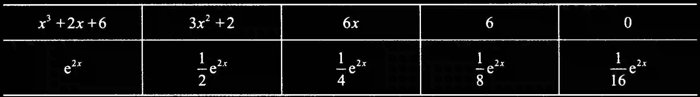

# 第9讲 一元函数积分学的计算

## 一、基本积分公式

以下 10 组公式, 要牢记.

① $\displaystyle\int {x}^{k}\mathrm{\;d}x = \displaystyle\frac{1}{k + 1}{x}^{k + 1} + C, k \neq - 1$ ; $\left\{ \begin{array}{l} \displaystyle\int \displaystyle\frac{1}{{x}^{2}}\mathrm{\;d}x = - \displaystyle\frac{1}{x} + C, \\\\ \displaystyle\int \displaystyle\frac{1}{\sqrt{x}}\mathrm{\;d}x = 2\sqrt{x} + C. \end{array}\right.$

② $\displaystyle\int \displaystyle\frac{1}{x}\mathrm{\;d}x = \ln \left| x\right| + C$ .

③ $\displaystyle\int {\mathrm{e}}^{x}\mathrm{\;d}x = {\mathrm{e}}^{x} + C;\displaystyle\int {a}^{x}\mathrm{\;d}x = \displaystyle\frac{{a}^{x}}{\ln a} + C, a > 0$ 且 $a \neq 1$ .

④

$\displaystyle\int \sin x\mathrm{\;d}x = - \cos x + C;\;\displaystyle\int \cos x\mathrm{\;d}x = \sin x + C$ ;

$\displaystyle\int \tan x\mathrm{\;d}x = - \ln \left| {\cos x}\right| + C;\;\displaystyle\int \cot x\mathrm{\;d}x = \ln \left| {\sin x}\right| + C;$

$\displaystyle\int \displaystyle\frac{\mathrm{d}x}{\cos x} = \displaystyle\int \sec x\mathrm{\;d}x = \ln \left| {\sec x + \tan x}\right| + C;$

$\displaystyle\int \displaystyle\frac{\mathrm{d}x}{\sin x} = \displaystyle\int \csc x\mathrm{\;d}x = \ln \left| {\csc x - \cot x}\right| + C;$

$\displaystyle\int {\sec }^{2}x\mathrm{\;d}x = \tan x + C;\;\displaystyle\int {\csc }^{2}x\mathrm{\;d}x = - \cot x + C;$

$\displaystyle\int \sec x\tan x\mathrm{\;d}x = \sec x + C;\;\displaystyle\int \csc x\cot x\mathrm{\;d}x = - \csc x + C.$

⑤ $\left\{ \begin{array}{l} \displaystyle\int \displaystyle\frac{1}{1 + {x}^{2}}\mathrm{\;d}x = \arctan x + C, \\\\ \displaystyle\int \displaystyle\frac{1}{{a}^{2} + {x}^{2}}\mathrm{\;d}x = \displaystyle\frac{1}{a}\arctan \displaystyle\frac{x}{a} + C\left( {a > 0}\right) . \end{array}\right.$

⑥ $\left\{ \begin{array}{l} \displaystyle\int \displaystyle\frac{1}{\sqrt{1 - {x}^{2}}}\mathrm{\;d}x = \arcsin x + C, \\\\ \displaystyle\int \displaystyle\frac{1}{\sqrt{{a}^{2} - {x}^{2}}}\mathrm{\;d}x = \arcsin \displaystyle\frac{x}{a} + C\left( {a > 0}\right) . \end{array}\right.$

⑦ $\left\{ \begin{array}{l} \displaystyle\int \displaystyle\frac{1}{\sqrt{{x}^{2} + {a}^{2}}}\mathrm{\;d}x = \ln \left( {x + \sqrt{{x}^{2} + {a}^{2}}}\right) + C\text{ (常见 }a = 1), \\\\ \displaystyle\int \displaystyle\frac{1}{\sqrt{{x}^{2} - {a}^{2}}}\mathrm{\;d}x = \ln \left| {x + \sqrt{{x}^{2} - {a}^{2}}}\right| + C\left( {\left| x\right| > \left| a\right| }\right) . \end{array}\right.$

⑧ $\displaystyle\int \displaystyle\frac{1}{{x}^{2} - {a}^{2}}\mathrm{\;d}x = \displaystyle\frac{1}{2a}\ln \left| \displaystyle\frac{x - a}{x + a}\right| + C\left( {\displaystyle\int \displaystyle\frac{1}{{a}^{2} - {x}^{2}}\mathrm{\;d}x = \displaystyle\frac{1}{2a}\ln \left| \displaystyle\frac{x + a}{x - a}\right| + C}\right)$ .

⑨ $\displaystyle\int \sqrt{{a}^{2} - {x}^{2}}\mathrm{\;d}x = \displaystyle\frac{{a}^{2}}{2}\arcsin \displaystyle\frac{x}{a} + \displaystyle\frac{x}{2}\sqrt{{a}^{2} - {x}^{2}} + C\left( {a > \left| x\right| \geq 0}\right)$ .

⑩

$\displaystyle\int {\sin }^{2}x\mathrm{\;d}x = \displaystyle\frac{x}{2} - \displaystyle\frac{\sin {2x}}{4} + C\left( {{\sin }^{2}x = \displaystyle\frac{1 - \cos {2x}}{2}}\right)$ ;

$\displaystyle\int {\cos }^{2}x\mathrm{\;d}x = \displaystyle\frac{x}{2} + \displaystyle\frac{\sin {2x}}{4} + C\left( {{\cos }^{2}x = \displaystyle\frac{1 + \cos {2x}}{2}}\right) ;$

$\displaystyle\int {\tan }^{2}x\mathrm{\;d}x = \tan x - x + C\left( {{\tan }^{2}x = {\sec }^{2}x - 1}\right) ;$

$\displaystyle\int {\cot }^{2}x\mathrm{\;d}x = - \cot x - x + C\left( {{\cot }^{2}x = {\csc }^{2}x - 1}\right) .$

## 二、不定积分的积分法

### 1. 凑微分法

$$
\displaystyle\int f\left\lbrack {g\left( x\right) }\right\rbrack {g}^{\prime }\left( x\right) \mathrm{d}x = \displaystyle\int f\left\lbrack {g\left( x\right) }\right\rbrack \mathrm{d}\left\lbrack {g\left( x\right) }\right\rbrack = \displaystyle\int f\left( u\right) \mathrm{d}u.
$$

---

【注 1】当被积函数比较复杂时,拿出一部分放到 $\mathrm{d}$ 后面去,若能凑成 $\displaystyle\int f\left( u\right) \mathrm{d}u$ 的形式,则凑微分成功. 比如,

$$
\displaystyle\int \displaystyle\frac{{\ln }^{5}x}{x}\mathrm{\;d}x = \displaystyle\int {\ln }^{5}x \cdot \displaystyle\frac{1}{x}\mathrm{\;d}x = \displaystyle\int {\ln }^{5}x\mathrm{\;d}\left( {\ln x}\right) = \displaystyle\frac{{\ln }^{6}x}{6} + C.
$$

---

【注 2】常用的凑微分公式:

① 由于 $x\mathrm{\;d}x = \displaystyle\frac{1}{2}\mathrm{\;d}\left( {x}^{2}\right)$ ,故 $\displaystyle\int {xf}\left( {x}^{2}\right) \mathrm{d}x = \displaystyle\frac{1}{2}\displaystyle\int f\left( {x}^{2}\right) \mathrm{d}\left( {x}^{2}\right) = \displaystyle\frac{1}{2}\displaystyle\int f\left( u\right) \mathrm{d}u$ .

② 由于 $\sqrt{x}\mathrm{\;d}x = \displaystyle\frac{2}{3}\mathrm{\;d}\left( {x}^{\frac{3}{2}}\right)$ ,故 $\displaystyle\int \sqrt{x}f\left( {x}^{\frac{3}{2}}\right) \mathrm{d}x = \displaystyle\frac{2}{3}\displaystyle\int f\left( {x}^{\frac{3}{2}}\right) \mathrm{d}\left( {x}^{\frac{3}{2}}\right) = \displaystyle\frac{2}{3}\displaystyle\int f\left( u\right) \mathrm{d}u$ .

③ 由于 $\displaystyle\frac{\mathrm{d}x}{\sqrt{x}} = 2\mathrm{\;d}\left( \sqrt{x}\right)$ ,故 $\displaystyle\int \displaystyle\frac{f\left( \sqrt{x}\right) }{\sqrt{x}}\mathrm{\;d}x = 2\displaystyle\int f\left( \sqrt{x}\right) \mathrm{d}\left( \sqrt{x}\right) = 2\displaystyle\int f\left( u\right) \mathrm{d}u$ .

④ 由于 $\displaystyle\frac{\mathrm{d}x}{{x}^{2}} = \mathrm{d}\left( {-\displaystyle\frac{1}{x}}\right)$ ,故 $\displaystyle\int \displaystyle\frac{f\left( {-\displaystyle\frac{1}{x}}\right) }{{x}^{2}}\mathrm{\;d}x = \displaystyle\int f\left( {-\displaystyle\frac{1}{x}}\right) \mathrm{d}\left( {-\displaystyle\frac{1}{x}}\right) = \displaystyle\int f\left( u\right) \mathrm{d}u$ .

⑤ 由于当 $x > 0$ 时, $\displaystyle\frac{1}{x}\mathrm{\;d}x = \mathrm{d}\left( {\ln x}\right)$ ,故 $\displaystyle\int \displaystyle\frac{f\left( {\ln x}\right) }{x}\mathrm{\;d}x = \displaystyle\int f\left( {\ln x}\right) \mathrm{d}\left( {\ln x}\right) = \displaystyle\int f\left( u\right) \mathrm{d}u$ .

⑥ 由于 ${\mathrm{e}}^{x}\mathrm{\;d}x = \mathrm{d}\left( {\mathrm{e}}^{x}\right)$ ,故 $\displaystyle\int {\mathrm{e}}^{x}f\left( {\mathrm{e}}^{x}\right) \mathrm{d}x = \displaystyle\int f\left( {\mathrm{e}}^{x}\right) \mathrm{d}\left( {\mathrm{e}}^{x}\right) = \displaystyle\int f\left( u\right) \mathrm{d}u$ .

⑦ 由于 ${a}^{x}\mathrm{\;d}x = \displaystyle\frac{1}{\ln a}\mathrm{\;d}\left( {a}^{x}\right), a > 0, a \neq 1$ ,故 $\displaystyle\int {a}^{x}f\left( {a}^{x}\right) \mathrm{d}x = \displaystyle\frac{1}{\ln a}\displaystyle\int f\left( {a}^{x}\right) \mathrm{d}\left( {a}^{x}\right) = \displaystyle\frac{1}{\ln a}\displaystyle\int f\left( u\right) \mathrm{d}u$ .

⑧ 由于 $\sin x\mathrm{\;d}x = \mathrm{d}\left( {-\cos x}\right)$ ,故 $\displaystyle\int \sin x \cdot f\left( {-\cos x}\right) \mathrm{d}x = \displaystyle\int f\left( {-\cos x}\right) \mathrm{d}\left( {-\cos x}\right) = \displaystyle\int f\left( u\right) \mathrm{d}u$

⑨ 由于 $\cos x\mathrm{\;d}x = \mathrm{d}\left( {\sin x}\right)$ ,故 $\displaystyle\int \cos x \cdot f\left( {\sin x}\right) \mathrm{d}x = \displaystyle\int f\left( {\sin x}\right) \mathrm{d}\left( {\sin x}\right) = \displaystyle\int f\left( u\right) \mathrm{d}u$ .

⑩ 由于 $\displaystyle\frac{\mathrm{d}x}{{\cos }^{2}x} = {\sec }^{2}x\mathrm{\;d}x = \mathrm{d}\left( {\tan x}\right)$ ,故 $\displaystyle\int \displaystyle\frac{f\left( {\tan x}\right) }{{\cos }^{2}x}\mathrm{\;d}x = \displaystyle\int f\left( {\tan x}\right) \mathrm{d}\left( {\tan x}\right) = \displaystyle\int f\left( u\right) \mathrm{d}u$ .

⑪ 由于 $\displaystyle\frac{\mathrm{d}x}{{\sin }^{2}x} = {\csc }^{2}x\mathrm{\;d}x = \mathrm{d}\left( {-\cot x}\right)$ ,故 $\displaystyle\int \displaystyle\frac{f\left( {-\cot x}\right) }{{\sin }^{2}x}\mathrm{\;d}x = \displaystyle\int f\left( {-\cot x}\right) \mathrm{d}\left( {-\cot x}\right) = \displaystyle\int f\left( u\right) \mathrm{d}u$ .

⑫ 由于 $\displaystyle\frac{1}{1 + {x}^{2}}\mathrm{\;d}x = \mathrm{d}\left( {\arctan x}\right)$ ,故 $\displaystyle\int \displaystyle\frac{f\left( {\arctan x}\right) }{1 + {x}^{2}}\mathrm{\;d}x = \displaystyle\int f\left( {\arctan x}\right) \mathrm{d}\left( {\arctan x}\right) = \displaystyle\int f\left( u\right) \mathrm{d}u$ .

⑬ 由于 $\displaystyle\frac{1}{\sqrt{1 - {x}^{2}}}\mathrm{\;d}x = \mathrm{d}\left( {\arcsin x}\right)$ ,故 $\displaystyle\int \displaystyle\frac{f\left( {\arcsin x}\right) }{\sqrt{1 - {x}^{2}}}\mathrm{\;d}x = \displaystyle\int f\left( {\arcsin x}\right) \mathrm{d}\left( {\arcsin x}\right) = \displaystyle\int f\left( u\right) \mathrm{d}u$ .

---

例 9.1 求不定积分 $\displaystyle\int \displaystyle\frac{\sqrt{x}}{\sqrt{4 - {x}^{3}}}\mathrm{\;d}x$ .

解

$$
\displaystyle\int \displaystyle\frac{\sqrt{x}}{\sqrt{4 - {x}^{3}}}\mathrm{\;d}x = \displaystyle\frac{2}{3}\displaystyle\int \displaystyle\frac{\mathrm{d}\left( {x}^{\displaystyle\frac{3}{2}}\right) }{\sqrt{4 - {\left( {x}^{\displaystyle\frac{3}{2}}\right) }^{2}}} = \displaystyle\frac{2}{3}\displaystyle\int \displaystyle\frac{\mathrm{d}\left( {x}^{\displaystyle\frac{3}{2}}\right) }{2\sqrt{1 - {\left( \displaystyle\frac{1}{2}{x}^{\displaystyle\frac{3}{2}}\right) }^{2}}}
$$

$$
= \displaystyle\frac{2}{3}\displaystyle\int \displaystyle\frac{\mathrm{d}\left( {\displaystyle\frac{1}{2}{x}^{\displaystyle\frac{3}{2}}}\right) }{\sqrt{1 - {\left( \displaystyle\frac{1}{2}{x}^{\displaystyle\frac{3}{2}}\right) }^{2}}} = \displaystyle\frac{2}{3}\arcsin \left( {\displaystyle\frac{1}{2}{x}^{\displaystyle\frac{3}{2}}}\right) + C.
$$

例 9.2 求不定积分 $\displaystyle\int {\mathrm{e}}^{\displaystyle\frac{\sin \theta }{\cos \theta + \sin \theta }} \cdot \displaystyle\frac{1}{{\left( \cos \theta + \sin \theta \right) }^{2}}\mathrm{\;d}\theta$ .

**分析** 若不是常用的凑微分公式,则可对被积函数的复杂部分 $g\left( x\right)$ 求导,若 ${g}^{\prime }\left( x\right) = f\left( x\right)$ ,即 $\mathrm{d}\left\lbrack {g\left( x\right) }\right\rbrack = f\left( x\right) \mathrm{d}x$ ,则 $\displaystyle\int f\left( x\right) g\left( x\right) \mathrm{d}x = \displaystyle\int g\left( x\right) \mathrm{d}\left\lbrack {g\left( x\right) }\right\rbrack$ ,凑微分成功.

**解** 对复杂部分求导:

$$
{\left( \displaystyle\frac{\sin \theta }{\cos \theta + \sin \theta }\right) }^{\prime } = \displaystyle\frac{\cos \theta \left( {\cos \theta + \sin \theta }\right) - \sin \theta \left( {-\sin \theta + \cos \theta }\right) }{{\left( \cos \theta + \sin \theta \right) }^{2}} = \displaystyle\frac{1}{{\left( \cos \theta + \sin \theta \right) }^{2}},
$$

故

$$
\mathrm{d}\left( \displaystyle\frac{\sin \theta }{\cos \theta + \sin \theta }\right) = \displaystyle\frac{1}{{\left( \cos \theta + \sin \theta \right) }^{2}}\mathrm{\;d}\theta ,
$$

于是

$$
\text{原式} = \displaystyle\int {\mathrm{e}}^{\displaystyle\frac{\sin \theta }{\cos \theta + \sin \theta }}\mathrm{d}\left( \displaystyle\frac{\sin \theta }{\cos \theta + \sin \theta }\right) = {\mathrm{e}}^{\displaystyle\frac{\sin \theta }{\cos \theta + \sin \theta }} + C\text{.}
$$

### 2. 换元法

#### (1) 基本思想

$$
\displaystyle\int f\left( x\right) \mathrm{d}x\displaystyle\xlongequal{x = g\left( u\right) }\displaystyle\int f\left\lbrack {g\left( u\right) }\right\rbrack \mathrm{d}\left\lbrack {g\left( u\right) }\right\rbrack = \displaystyle\int f\left\lbrack {g\left( u\right) }\right\rbrack {g}^{\prime }\left( u\right) \mathrm{d}u.
$$

---

【注】(1) 当被积函数不容易积分 (比如含有根式或含有反三角函数) 时, 可以通过换元的方法从 $\mathrm{d}$ 后面拿出一部分放到前面来,就成为 $\displaystyle\int f\left\lbrack {g\left( u\right) }\right\rbrack {g}^{\prime }\left( u\right) \mathrm{d}u$ 的形式,若 $f\left\lbrack {g\left( u\right) }\right\rbrack {g}^{\prime }\left( u\right)$ 容易积分,则换元成功.

(2) $x = g\left( u\right)$ 须是单调可导函数,且不要忘记计算结束后用反函数 $u = {g}^{-1}\left( x\right)$ 回代.

---

#### (2) 常用换元法

①三角函数代换：当被积函数含有如下根式时,可作三角函数代换,这里 $a > 0$ .

$$
\begin{aligned}&\sqrt{a^{2}-x^{2}} \to \text{令}x=a\sin t , \left|t\right|<\frac{\pi}{2} ,\\\\&\sqrt{a^{2}+x^{2}} \to \text{令}x=a\tan t , \left|t\right|<\frac{\pi}{2} ,\\\\&\sqrt{x^{2}-a^{2}} \to \text{令}x=a\sec t , \begin{cases}\text{若}x>0 ,\text{则} 0<t<\frac{\pi}{2} ,\\\\\text{若}x<0 ,\text{则}\frac{\pi}{2}<t<\pi.\end{cases}\end{aligned}
$$

②恒等变形后作三角函数代换：当被积函数含有根式 $\sqrt{a{x}^{2} + {bx} + c}$ 时,可先化为以下三种形式 $\sqrt{{\varphi }^{2}\left( x\right) + {k}^{2}},\sqrt{{\varphi }^{2}\left( x\right) - {k}^{2}},\sqrt{{k}^{2} - {\varphi }^{2}\left( x\right) }$ ,再作三角函数代换.

③根式代换：当被积函数含有根式 $\sqrt[n]{{ax} + b},\sqrt{\displaystyle\frac{{ax} + b}{{cx} + d}},\sqrt{a{\mathrm{e}}^{bx} + c}$ 等时,一般令根式 $\sqrt{ * } = t$ (因为事实上,很难通过根号内换元的办法凑成平方,所以根号无法去掉 $)$ . 对既含有 $\sqrt[n]{{ax} + b}$ ,也含有 $\sqrt[m]{{ax} + b}$ 的函数,一般取 $m, n$ 的最小公倍数 $l$ ,令 $\sqrt[l]{{ax} + b} = t$ .

*“举重若轻” 解题利器: “令复杂 $= t$ ”*

④倒代换：当被积函数分母的幂次比分子高两次及两次以上时,作倒代换,令 $x = \displaystyle\frac{1}{t}$ .

⑤复杂函数的直接代换：当被积函数中含有 ${a}^{x},{\mathrm{e}}^{x},\ln x,\arcsin x,\arctan x$ 等时,可考虑直接令复杂函数等于 $t$ ,值得指出的是,当 $\ln x,\arcsin x,\arctan x$ 与 ${P}_{n}\left( x\right)$ 或 ${\mathrm{e}}^{ax}$ 作乘法时 (其中 ${P}_{n}\left( x\right)$ 为 $x$ 的 $n$ 次多项式), 优先考虑分部积分法.

例 9.3 求不定积分 $\displaystyle\int \sqrt{{a}^{2} - {x}^{2}}\mathrm{\;d}x\left( {a > 0}\right)$ 。

解 设 $x = a\sin t$ ,则 $\mathrm{d}x = a\cos t\mathrm{\;d}t, t = \arcsin \displaystyle\frac{x}{a}$ ,

$- a \leq x \leq a, - \displaystyle\frac{\pi }{2} \leq t \leq \displaystyle\frac{\pi }{2}$

所以

$$
\displaystyle\int \sqrt{{a}^{2} - {x}^{2}}\mathrm{\;d}x = \displaystyle\int \sqrt{{a}^{2} - {a}^{2}{\sin }^{2}t} \cdot a\cos t\mathrm{\;d}t = {a}^{2}\displaystyle\int {\cos }^{2}t\mathrm{\;d}t = \displaystyle\frac{{a}^{2}}{2}\displaystyle\int \left( {1 + \cos {2t}}\right) \mathrm{d}t
$$

$$
= \displaystyle\frac{{a}^{2}}{2}t + \displaystyle\frac{{a}^{2}}{4}\sin {2t} + C = \displaystyle\frac{{a}^{2}}{2}t + \displaystyle\frac{{a}^{2}}{2}\sin t\cos t + C
$$

$$
= \displaystyle\frac{{a}^{2}}{2}\arcsin \displaystyle\frac{x}{a} + \displaystyle\frac{x}{2}\sqrt{{a}^{2} - {x}^{2}} + C.
$$

> 附  
>（1） 若 $R(\sin x, \cos x) = R(-\sin x, \cos x)$ ，即 $\sin x$ 是奇数次幂，则令 $\cos x = t$  
>（2） 若 $R(\sin x, \cos x) = R(\sin x, -\cos x)$ ，即 $\cos x$ 是奇数次幂，则令 $\sin x = t$  
>（3） 若 $R(\sin x, \cos x) = R(-\sin x, -\cos x)$ ，则令 $\tan x = t$

### 3. 分部积分法

#### (1) $\displaystyle\int u\mathrm{\;d}v = {uv} - \displaystyle\int v\mathrm{\;d}u$

---

【注 1】这个方法主要适用于求 $\displaystyle\int u\mathrm{\;d}v$ 比较困难,而 $\displaystyle\int v\mathrm{\;d}u$ 比较容易的情形.

---

【注 2】积分后会 “简单” 些的函数宜取作 $v$ ; 微分后会 “简单” 些的函数宜取作 $u$ . 故 $u, v$ 的选取原则为

**反对幂指三** 或 **反对幂三指**

相对位置在左边的宜选作 $u$ ,用来求导; 相对位置在右边的宜选作 $v$ ,用来积分,即

(1) 被积函数为 ${P}_{n}\left( x\right) {\mathrm{e}}^{kx},{P}_{n}\left( x\right) \sin {ax},{P}_{n}\left( x\right) \cos {ax}$ 等形式时,一般来说选取 $u = {P}_{n}\left( x\right)$ ;

(2) 被积函数为 ${\mathrm{e}}^{ax}\sin {bx},{\mathrm{e}}^{ax}\cos {bx}$ 等形式时, $u$ 可以取两因子中的任意一个;

(3) 被积函数为 ${P}_{n}\left( x\right) \ln x,{P}_{n}\left( x\right) \arcsin x,{P}_{n}\left( x\right) \arctan x$ 等形式时,一般分别选取

$$
u = \ln x, u = \arcsin x, u = \arctan x.
$$

---

#### (2) 分部积分法的推广公式与 $\displaystyle\int {P}_{n}\left( x\right) {\mathrm{e}}^{kx}\mathrm{\;d}x,\displaystyle\int {P}_{n}\left( x\right) \sin {ax}\mathrm{\;d}x,\displaystyle\int {P}_{n}\left( x\right) \cos {bx}\mathrm{\;d}x$

设函数 $u = u\left( x\right)$ 与 $v = v\left( x\right)$ 具有直到第 $\left( {n + 1}\right)$ 阶的连续导数,并根据分部积分公式

$$
\displaystyle\int u\mathrm{\;d}v = {uv} - \displaystyle\int v\mathrm{\;d}u
$$

则有

$$
\displaystyle\int u{v}^{\left( n + 1\right) }\mathrm{d}x = u{v}^{\left( n\right) } - {u}^{\prime }{v}^{\left( n - 1\right) } + {u}^{\prime \prime }{v}^{\left( n - 2\right) } - \cdots + {\left( -1\right) }^{n}{u}^{\left( n\right) }v + {\left( -1\right) }^{n + 1}\displaystyle\int {u}^{\left( n + 1\right) }v\mathrm{\;d}x.
$$

---

【注】证明 $n = 3$ 时,如下:

$$
\displaystyle\int u{v}^{\left( 4\right) }\mathrm{d}x = u{v}^{\left( 3\right) } - {u}^{\prime }{v}^{\prime \prime } + {u}^{\prime \prime }{v}^{\prime } - {u}^{\left( 3\right) }v + \displaystyle\int {u}^{\left( 4\right) }v\mathrm{\;d}x.
$$

证明

$$
\displaystyle\int u{v}^{\left( 4\right) }\mathrm{d}x = \displaystyle\int u\mathrm{\;d}\left\lbrack {v}^{\left( 3\right) }\right\rbrack = u{v}^{\left( 3\right) } - \displaystyle\int {u}^{\prime }{v}^{\left( 3\right) }\mathrm{d}x,
$$

$$
\displaystyle\int {u}^{\prime }{v}^{\left( 3\right) }\mathrm{d}x = \displaystyle\int {u}^{\prime }\mathrm{d}\left( {v}^{\prime \prime }\right) = {u}^{\prime }{v}^{\prime \prime } - \displaystyle\int {u}^{\prime \prime }{v}^{\prime \prime }\mathrm{d}x,
$$

$$
\displaystyle\int {u}^{\prime \prime }{v}^{\prime \prime }\mathrm{d}x = \displaystyle\int {u}^{\prime \prime }\mathrm{d}\left( {v}^{\prime }\right) = {u}^{\prime \prime }{v}^{\prime } - \displaystyle\int {u}^{\left( 3\right) }{v}^{\prime }\mathrm{d}x,
$$

$$
\displaystyle\int {u}^{\left( 3\right) }{v}^{\prime }\mathrm{d}x = \displaystyle\int {u}^{\left( 3\right) }\mathrm{d}v = {u}^{\left( 3\right) }v - \displaystyle\int {u}^{\left( 4\right) }v\mathrm{\;d}x.
$$

联立以上式子, 得

$$
\displaystyle\int u{v}^{\left( 4\right) }\mathrm{d}x = u{v}^{\left( 3\right) } - {u}^{\prime }{v}^{\prime \prime } + {u}^{\prime \prime }{v}^{\prime } - {u}^{\left( 3\right) }v + \displaystyle\int {u}^{\left( 4\right) }v\mathrm{\;d}x.
$$

事实上, 可写成如下表格

计算方法: 以 $u$ 作起点左上、右下错位相乘,各项符号 “+ ” “-” 相间,最后一项为 $\displaystyle\int {u}^{\left( 4\right) }v\mathrm{\;d}x$ .

比如,求不定积分 $\displaystyle\int \left( {{x}^{3} + {2x} + 6}\right) {\mathrm{e}}^{2x}\mathrm{\;d}x$ ,则利用上述表格, 可得

原式 $= \left( {{x}^{3} + {2x} + 6}\right) \left( {\displaystyle\frac{1}{2}{\mathrm{e}}^{2x}}\right) - \left( {3{x}^{2} + 2}\right) \left( {\displaystyle\frac{1}{4}{\mathrm{e}}^{2x}}\right) + {6x}\left( {\displaystyle\frac{1}{8}{\mathrm{e}}^{2x}}\right) - 6\left( {\displaystyle\frac{1}{16}{\mathrm{e}}^{2x}}\right) + \displaystyle\int 0 \cdot \left( {\displaystyle\frac{1}{16}{\mathrm{e}}^{2x}}\right) \mathrm{d}x$

$$
= \left( {\displaystyle\frac{1}{2}{x}^{3} - \displaystyle\frac{3}{4}{x}^{2} + \displaystyle\frac{7}{4}x + \displaystyle\frac{17}{8}}\right) {\mathrm{e}}^{2x} + C.
$$

---

例 9.4 求不定积分 $\displaystyle\int \displaystyle\frac{x{\mathrm{e}}^{x}}{\sqrt{{\mathrm{e}}^{x} - 1}}\mathrm{\;d}x$ .

解 本题主要考查换元法、分部积分法.

令 $u = \sqrt{{\mathrm{e}}^{x} - 1}$ ,则 $x = \ln \left( {1 + {u}^{2}}\right) ,\mathrm{d}x = \displaystyle\frac{2u}{1 + {u}^{2}}\mathrm{\;d}u$ ,从而

$$
\displaystyle\int \displaystyle\frac{x{\mathrm{e}}^{x}}{\sqrt{{\mathrm{e}}^{x} - 1}}\mathrm{\;d}x = \displaystyle\int \displaystyle\frac{\left( {1 + {u}^{2}}\right) \ln \left( {1 + {u}^{2}}\right) }{u} \cdot \displaystyle\frac{2u}{1 + {u}^{2}}\mathrm{\;d}u = 2\displaystyle\int \ln \left( {1 + {u}^{2}}\right) \mathrm{d}u
$$

$$
= {2u}\ln \left( {1 + {u}^{2}}\right) - \displaystyle\int \displaystyle\frac{4{u}^{2}}{1 + {u}^{2}}\mathrm{\;d}u = {2u}\ln \left( {1 + {u}^{2}}\right) - {4u} + 4\arctan u + C
$$

$$
= {2x}\sqrt{{\mathrm{e}}^{x} - 1} - 4\sqrt{{\mathrm{e}}^{x} - 1} + 4\arctan \sqrt{{\mathrm{e}}^{x} - 1} + C.
$$

例 9.5 求不定积分 $\displaystyle\int \displaystyle\frac{x{\mathrm{e}}^{\arctan x}}{{\left( 1 + {x}^{2}\right) }^{\displaystyle\frac{3}{2}}}\mathrm{\;d}x$ .

解 本题涉及换元法、凑微分法和分部积分法.

设 $x = \tan t$ ,则

$$
\displaystyle\int \displaystyle\frac{x{\mathrm{e}}^{\arctan x}}{{\left( 1 + {x}^{2}\right) }^{\displaystyle\frac{3}{2}}}\mathrm{\;d}x = \displaystyle\int \displaystyle\frac{{\mathrm{e}}^{t}\tan t}{{\left( 1 + {\tan }^{2}t\right) }^{\displaystyle\frac{3}{2}}}{\sec }^{2}t\mathrm{\;d}t = \displaystyle\int {\mathrm{e}}^{t}\sin t\mathrm{\;d}t,
$$

又

$$
\displaystyle\int {\mathrm{e}}^{t}\sin t\mathrm{\;d}t  \displaystyle\xlongequal{\left( *\right) } - \displaystyle\int {\mathrm{e}}^{t}\mathrm{\;d}\left( {\cos t}\right) = - \left( {{\mathrm{e}}^{t}\cos t-\displaystyle\int {\mathrm{e}}^{t}\cos t\mathrm{\;d}t}\right)
$$

$$
= - {\mathrm{e}}^{t}\cos t + {\mathrm{e}}^{t}\sin t - \displaystyle\int {\mathrm{e}}^{t}\sin t\mathrm{\;d}t,
$$

故原式 $= \displaystyle\int {\mathrm{e}}^{t}\sin t\mathrm{\;d}t = \displaystyle\frac{1}{2}{\mathrm{e}}^{t}\left( {\sin t - \cos t}\right) + C = \displaystyle\frac{\left( {x - 1}\right) {\mathrm{e}}^{\arctan x}}{2\sqrt{1 + {x}^{2}}} + C$ .

---

【注】(*) 处亦可直接套用如下公式:

① $\displaystyle\int {\mathrm{e}}^{ax}\sin {bx}\mathrm{\;d}x = \displaystyle\frac{\left| \begin{matrix} {\left( {\mathrm{e}}^{ax}\right) }^{\prime } & {\left( \sin bx\right) }^{\prime } \\ {\mathrm{e}}^{ax} & \sin {bx} \end{matrix}\right| }{{a}^{2} + {b}^{2}} + C = \displaystyle\frac{a{\mathrm{e}}^{ax}\sin {bx} - b{\mathrm{e}}^{ax}\cos {bx}}{{a}^{2} + {b}^{2}} + C$ ;

② $\displaystyle\int {\mathrm{e}}^{ax}\cos {bx}\mathrm{\;d}x = \displaystyle\frac{\left| \begin{matrix} {\left( {\mathrm{e}}^{ax}\right) }^{\prime } & {\left( \cos bx\right) }^{\prime } \\ {\mathrm{e}}^{ax} & \cos {bx} \end{matrix}\right| }{{a}^{2} + {b}^{2}} + C = \displaystyle\frac{a{\mathrm{e}}^{ax}\cos {bx} + b{\mathrm{e}}^{ax}\sin {bx}}{{a}^{2} + {b}^{2}} + C$ .

再如, $\displaystyle\int {\mathrm{e}}^{-x}\sin {nx}\mathrm{\;d}x = \displaystyle\frac{-{\mathrm{e}}^{-x}\sin {nx} - n{\mathrm{e}}^{-x}\cos {nx}}{{\left( -1\right) }^{2} + {n}^{2}} + C$ .

---

例 9.6 设 $f\left( {\ln x}\right) = \displaystyle\frac{\ln \left( {1 + x}\right) }{x}$ ,计算 $\displaystyle\int f\left( x\right) \mathrm{d}x$ .

分析 本题首先要求出 $f\left( x\right)$ 的表达式,一般方法是令 $t = \ln x$ . 其次,计算具体积分时,或先凑微分再分部积分, 或换元再分部积分.

解 设 $\ln x = t$ ,则 $x = {\mathrm{e}}^{t}, f\left( t\right) = \displaystyle\frac{\ln \left( {1 + {\mathrm{e}}^{t}}\right) }{{\mathrm{e}}^{t}}$ ,故

$$
\displaystyle\int f\left( x\right) \mathrm{d}x = \displaystyle\int \displaystyle\frac{\ln \left( {1 + {\mathrm{e}}^{x}}\right) }{{\mathrm{e}}^{x}}\mathrm{\;d}x = - \displaystyle\int \ln \left( {1 + {\mathrm{e}}^{x}}\right) \mathrm{d}\left( {\mathrm{e}}^{-x}\right)
$$

$$
= - {\mathrm{e}}^{-x}\ln \left( {1 + {\mathrm{e}}^{x}}\right) + \displaystyle\int \displaystyle\frac{1}{1 + {\mathrm{e}}^{x}}\mathrm{\;d}x
$$

$$
= - {\mathrm{e}}^{-x}\ln \left( {1 + {\mathrm{e}}^{x}}\right) + \displaystyle\int \left( {1 - \displaystyle\frac{{\mathrm{e}}^{x}}{1 + {\mathrm{e}}^{x}}}\right) \mathrm{d}x
$$

$$
= - {\mathrm{e}}^{-x}\ln \left( {1 + {\mathrm{e}}^{x}}\right) + x - \ln \left( {1 + {\mathrm{e}}^{x}}\right) + C
$$

$$
= x - \left( {1 + {\mathrm{e}}^{-x}}\right) \ln \left( {1 + {\mathrm{e}}^{x}}\right) + C.
$$

例 9.7 计算不定积分 $\displaystyle\int {\mathrm{e}}^{2x}{\left( \tan x + 1\right) }^{2}\mathrm{\;d}x$ .

解

$$
\displaystyle\int {\mathrm{e}}^{2x}{\left( \tan x + 1\right) }^{2}\mathrm{\;d}x = \displaystyle\int {\mathrm{e}}^{2x}\left( {{\sec }^{2}x + 2\tan x}\right) \mathrm{d}x
$$

$$
= \displaystyle\int {\mathrm{e}}^{2x}{\sec }^{2}x\mathrm{\;d}x + 2\displaystyle\int {\mathrm{e}}^{2x}\tan x\mathrm{\;d}x
$$

$$
= \displaystyle\int {\mathrm{e}}^{2x}\mathrm{\;d}\left( {\tan x}\right) + 2\displaystyle\int {\mathrm{e}}^{2x}\tan x\mathrm{\;d}x
$$

$$
= {\mathrm{e}}^{2x}\tan x - 2\displaystyle\int {\mathrm{e}}^{2x}\tan x\mathrm{\;d}x + 2\displaystyle\int {\mathrm{e}}^{2x}\tan x\mathrm{\;d}x
$$

$$
= {\mathrm{e}}^{2x}\tan x + C\text{. }
$$

### 4. 有理函数的积分

#### (1) 定义

形如 $\displaystyle\int \displaystyle\frac{{P}_{n}\left( x\right) }{{Q}_{m}\left( x\right) }\mathrm{d}x\left( {n < m}\right)$ 的积分称为有理函数的积分,其中 ${P}_{n}\left( x\right) ,{Q}_{m}\left( x\right)$ 分别是 $x$ 的 $n$ 次多项式和 $m$ 次

多项式.

#### (2) 思想

若 ${Q}_{m}\left( x\right)$ 在实数域内可因式分解,则因式分解后再把 $\displaystyle\frac{{P}_{n}\left( x\right) }{{Q}_{m}\left( x\right) }$ 拆成若干项最简有理分式之和.

#### (3) 方法

① ${Q}_{m}\left( x\right)$ 的一次单因式 ${ax} + b$ 产生一项 $\displaystyle\frac{A}{{ax} + b}$ .

② ${Q}_{m}\left( x\right)$ 的 $k$ 重一次因式 ${\left( ax + b\right) }^{k}$ 产生 $k$ 项,分别为 $\displaystyle\frac{{A}_{1}}{{ax} + b},\displaystyle\frac{{A}_{2}}{{\left( ax + b\right) }^{2}},\cdots ,\displaystyle\frac{{A}_{k}}{{\left( ax + b\right) }^{k}}$ .

③ ${Q}_{m}\left( x\right)$ 的二次单因式 $p{x}^{2} + {qx} + r$ （ ${q}^{2} - {4pr} < 0$ ）产生一项 $\displaystyle\frac{{Ax} + B}{p{x}^{2} + {qx} + r}$ .

④ ${Q}_{m}\left( x\right)$ 的 $k$ 重二次因式 ${\left( p{x}^{2} + qx + r\right) }^{k}$ （ ${q}^{2} - {4pr} < 0$ ）产生 $k$ 项,分别为

$$
\displaystyle\frac{{A}_{1}x + {B}_{1}}{p{x}^{2} + {qx} + r},\displaystyle\frac{{A}_{2}x + {B}_{2}}{{\left( p{x}^{2} + qx + r\right) }^{2}},\cdots ,\displaystyle\frac{{A}_{k}x + {B}_{k}}{{\left( p{x}^{2} + qx + r\right) }^{k}}
$$

例 9.8 求 $\displaystyle\int \displaystyle\frac{4{x}^{2} - {6x} - 1}{\left( {x + 1}\right) {\left( 2x - 1\right) }^{2}}\mathrm{\;d}x$ .

解 本题主要考查有理函数的积分.

先将被积函数分解为最简有理分式之和. 这时应有分解式

$$
\displaystyle\frac{4{x}^{2} - {6x} - 1}{\left( {x + 1}\right) {\left( 2x - 1\right) }^{2}} = \displaystyle\frac{A}{x + 1} + \displaystyle\frac{B}{{2x} - 1} + \displaystyle\frac{C}{{\left( 2x - 1\right) }^{2}},
$$

问题是如何定出 $A, B, C$ 这三个数. 右边通分后等号左、右两边的分子应恒等,即

$$
4{x}^{2} - {6x} - 1 \equiv A{\left( 2x - 1\right) }^{2} + B\left( {x + 1}\right) \left( {{2x} - 1}\right) + C\left( {x + 1}\right) . \tag{*}
$$

由此恒等式不难定出 $A, B, C$ 来,常用的方法有两种.

一种方法是将等式右端展开, 得到

$$
4{x}^{2} - {6x} - 1 \equiv \left( {{4A} + {2B}}\right) {x}^{2} + \left( {-{4A} + B + C}\right) x + \left( {A - B + C}\right) ,
$$

因为这是恒等式,等号左、右两边 $x$ 的同次幂的系数应该相等,故应有

$$
\left\{ \begin{array}{l} {4A} + {2B} = 4, \\ - {4A} + B + C = - 6, \\ A - B + C = - 1, \end{array}\right.
$$

解得 $A = 1, B = 0, C = - 2$ .

这种方法比较死板,且解系数满足的方程组有时较烦琐. 我们希望能求得 $A, B, C$ 应满足的较简单的条件.

另一种方法是根据在恒等式中以变量 $x$ 的任意值代入等号两边应该得到相同的值,利用这一性质, 赋予 $x$ 适当的值,可以得到 $A, B, C$ 应满足的简单条件. 例如,在 $\left( *\right)$ 式中

令 $x = - 1$ ,有 $9 = {9A}, A = 1$ ;

令 $x = \displaystyle\frac{1}{2}$ ,有 $- 3 = \displaystyle\frac{3}{2}C, C = - 2$ ;

令 $x = 0$ ,有 $- 1 = A - B + C$ ,可求出 $B = 0$ .

两种方法求得的结果一致:

$$
\displaystyle\frac{4{x}^{2} - {6x} - 1}{\left( {x + 1}\right) {\left( 2x - 1\right) }^{2}} = \displaystyle\frac{1}{x + 1} - \displaystyle\frac{2}{{\left( 2x - 1\right) }^{2}}.
$$

因此可求得

$$
\displaystyle\int \displaystyle\frac{4{x}^{2} - {6x} - 1}{\left( {x + 1}\right) {\left( 2x - 1\right) }^{2}}\mathrm{\;d}x = \displaystyle\int \displaystyle\frac{\mathrm{d}x}{x + 1} - \displaystyle\int \displaystyle\frac{2}{{\left( 2x - 1\right) }^{2}}\mathrm{\;d}x
$$

$$
= \ln \left| {x + 1}\right| + \displaystyle\frac{1}{{2x} - 1} + C.
$$

例 9.9 求 $\displaystyle\int \displaystyle\frac{x}{{x}^{3} - {x}^{2} + x - 1}\mathrm{\;d}x$ .

解 本题主要考查有理函数的积分.

因为 ${x}^{3} - {x}^{2} + x - 1 = \left( {x - 1}\right) \left( {{x}^{2} + 1}\right)$ ,设

$$
\displaystyle\frac{x}{{x}^{3} - {x}^{2} + x - 1} = \displaystyle\frac{A}{x - 1} + \displaystyle\frac{{Bx} + C}{{x}^{2} + 1},
$$

这时应有

$$
x \equiv A\left( {{x}^{2} + 1}\right) + \left( {{Bx} + C}\right) \left( {x - 1}\right) , \tag{*}
$$

在 (*) 式中,令 $x = 1$ ,得 $1 = {2A}, A = \displaystyle\frac{1}{2}$ ; 令 $x = 0$ ,得 $0 = A - C, C = \displaystyle\frac{1}{2}$ .

比较 (*) 式两端 ${x}^{2}$ 的系数,有 $\;0 = A + B$ ,

已求得 $A = \displaystyle\frac{1}{2}$ ,故有 $B = - \displaystyle\frac{1}{2}$ . 于是可得

$$
\displaystyle\int \displaystyle\frac{x}{{x}^{3} - {x}^{2} + x - 1}\mathrm{\;d}x = \displaystyle\frac{1}{2}\displaystyle\int \displaystyle\frac{\mathrm{d}x}{x - 1} - \displaystyle\frac{1}{2}\displaystyle\int \displaystyle\frac{x - 1}{{x}^{2} + 1}\mathrm{\;d}x
$$

$$
= \displaystyle\frac{1}{2}\ln \left| {x - 1}\right| - \displaystyle\frac{1}{4}\ln \left( {{x}^{2} + 1}\right) + \displaystyle\frac{1}{2}\arctan x + C
$$

$$
= \displaystyle\frac{1}{4}\ln \displaystyle\frac{{\left( x - 1\right) }^{2}}{{x}^{2} + 1} + \displaystyle\frac{1}{2}\arctan x + C.
$$

例 9.10 $\displaystyle\int \displaystyle\frac{{2x} + 3}{{x}^{2} - x + 1}\mathrm{\;d}x =$

解 应填 $\ln \left( {{x}^{2} - x + 1}\right) + \displaystyle\frac{8\sqrt{3}}{3}\arctan \displaystyle\frac{{2x} - 1}{\sqrt{3}} + C$ .

> $\displaystyle\int \displaystyle\frac{{2x} + 3}{{x}^{2} - x + 1}\mathrm{\;d}x$ 已是最简有理分式，请注意看接下来的积分方法  
> 分子凑为“k(分母)’+常数”，用
> $\displaystyle\int \displaystyle\frac{{u}^{\prime }}{u}\mathrm{\;d}x = \displaystyle\int \displaystyle\frac{\mathrm{d}u}{u} = \ln u + C.$

$$
\displaystyle\int \displaystyle\frac{{2x} + 3}{{x}^{2} - x + 1}\mathrm{\;d}x = \displaystyle\int \displaystyle\frac{{2x} - 1 + 4}{{x}^{2} - x + 1}\mathrm{\;d}x
$$

$$
= \displaystyle\int \displaystyle\frac{1}{{x}^{2} - x + 1}\mathrm{\;d}\left( {{x}^{2} - x + 1}\right) + \displaystyle\int \displaystyle\frac{4}{{x}^{2} - x + 1}\mathrm{\;d}x
$$

$$
= \ln \left( {{x}^{2} - x + 1}\right) + 4\displaystyle\int \displaystyle\frac{1}{{x}^{2} - x + 1}\mathrm{\;d}x
$$

$$
= \ln \left( {{x}^{2} - x + 1}\right) + 4\displaystyle\int \displaystyle\frac{1}{{\left( x - \displaystyle\frac{1}{2}\right) }^{2} + {\left( \displaystyle\frac{\sqrt{3}}{2}\right) }^{2}}\mathrm{\;d}\left( {x - \displaystyle\frac{1}{2}}\right)
$$

$$
= \ln \left( {{x}^{2} - x + 1}\right) + \displaystyle\frac{8\sqrt{3}}{3}\arctan \displaystyle\frac{{2x} - 1}{\sqrt{3}} + C.
$$

## 三、定积分的计算

牛顿 - 莱布尼茨公式及其推广.

设函数 $F\left( x\right)$ 是连续函数 $f\left( x\right)$ 在 $\left\lbrack {a, b}\right\rbrack$ 上的一个原函数,则

$$
{\displaystyle\int }_{a}^{b}f\left( x\right) \mathrm{d}x = {\left. F\left( x\right) \right| }_{a}^{b} = F\left( b\right) - F\left( a\right) .
$$

---

【注】牛顿 - 莱布尼茨公式推广.

(1) 若 $f\left( x\right)$ 在 $\left\lbrack {a, b}\right\rbrack$ 上有原函数 $F\left( x\right)$ ,则 ${\displaystyle\int }_{a}^{b}f\left( x\right) \mathrm{d}x = F\left( b\right) - F\left( a\right)$ .

(2) 若 $f\left( x\right)$ 在 $\left\lbrack {a, b}\right\rbrack$ 上分段有原函数,如 $\lbrack a, c)$ 上有原函数 ${F}_{1}\left( x\right) ,(c, b\rbrack$ 上有原函数 ${F}_{2}\left( x\right)$ ,则

$$
{\displaystyle\int }_{a}^{b}f\left( x\right) \mathrm{d}x = {\displaystyle\int }_{a}^{c}f\left( x\right) \mathrm{d}x + {\displaystyle\int }_{c}^{b}f\left( x\right) \mathrm{d}x
$$

$$
= {F}_{1}\left( {c - 0}\right) - {F}_{1}\left( a\right) + {F}_{2}\left( b\right) - {F}_{2}\left( {c + 0}\right) .
$$

若 ${F}_{1}\left( {c - 0}\right) ,{F}_{2}\left( {c + 0}\right)$ 存在,则 ${\displaystyle\int }_{a}^{b}f\left( x\right) \mathrm{d}x$ 收敛.

若 ${F}_{1}\left( {c - 0}\right) ,{F}_{2}\left( {c + 0}\right)$ 至少有一个不存在,则 ${\displaystyle\int }_{a}^{b}f\left( x\right) \mathrm{d}x$ 发散,见习题 9.10.

---

例 9.11 设 $f\left( {x + \displaystyle\frac{1}{x}}\right) = \displaystyle\frac{x + {x}^{3}}{1 + {x}^{4}}$ ,则 ${\displaystyle\int }_{2}^{2\sqrt{2}}f\left( x\right) \mathrm{d}x =$

解 应填 $\displaystyle\frac{1}{2}\ln 3$ .

由例 1.1 知, $f\left( x\right) = \displaystyle\frac{x}{{x}^{2} - 2}$ ,则

$$
{\displaystyle\int }_{2}^{2\sqrt{2}}f\left( x\right) \mathrm{d}x = {\displaystyle\int }_{2}^{2\sqrt{2}}\displaystyle\frac{x}{{x}^{2} - 2}\mathrm{\;d}x = {\left. \displaystyle\frac{1}{2}\ln \left( {x}^{2} - 2\right) \right| }_{2}^{2\sqrt{2}} = \displaystyle\frac{1}{2}\ln 3.
$$

***换元要三换***

由牛顿 - 莱布尼茨公式结合不定积分的计算方法, 有定积分的换元积分法和分部积分法, 分别如下.

### (1) 定积分的换元积分法

设 $f\left( x\right)$ 在 $\left\lbrack {a, b}\right\rbrack$ 上连续,函数 $x = \varphi \left( t\right)$ 满足① $\varphi \left( \alpha \right) = a,\varphi \left( \beta \right) = b$ ; ② $x = \varphi \left( t\right)$ 在 $\left\lbrack {\alpha ,\beta }\right\rbrack$ (或 $\left\lbrack {\beta ,\alpha }\right\rbrack$ ) 上有连续的导数,且其值域为 ${R}_{\varphi } = \left\lbrack {a, b}\right\rbrack$ ,则有

$$
{\displaystyle\int }_{a}^{b}f\left( x\right) \mathrm{d}x = {\displaystyle\int }_{\alpha }^{\beta }f\left\lbrack {\varphi \left( t\right) }\right\rbrack {\varphi }^{\prime }\left( t\right) \mathrm{d}t.
$$

> 常考: 令 $x = \displaystyle\frac{\pi }{2} \pm t$ ,则有 $\left\{ \begin{array}{l} \sin \left( {\displaystyle\frac{\pi }{2} \pm t}\right) = \cos t; \\\\ \cos \left( {\displaystyle\frac{\pi }{2} \pm t}\right) = \mp \sin t; \end{array}\right.$
>
> 令 $x = \pi \pm t$ ，则有 $\left\{ \begin{array}{l} \sin \left( {\pi \pm t}\right) = \mp \sin t; \\ \cos \left( {\pi \pm t}\right) = - \cos t. \end{array}\right.$

---

【注】当 $\varphi \left( t\right)$ 的值域 ${R}_{\varphi }$ 超出 $\left\lbrack {a, b}\right\rbrack$ ,但 $\varphi \left( t\right)$ 满足其余条件时,只要 $f\left( x\right)$ 在 ${R}_{\varphi }$ 上连续,则上述结论仍成立.

---

### (2) 定积分的分部积分法

$$
{\displaystyle\int }_{a}^{b}u\left( x\right) {v}^{\prime }\left( x\right) \mathrm{d}x = {\left. u\left( x\right) v\left( x\right) \right| }_{a}^{b} - {\displaystyle\int }_{a}^{b}v\left( x\right) {u}^{\prime }\left( x\right) \mathrm{d}x,
$$

这里要求 ${u}^{\prime }\left( x\right) ,{v}^{\prime }\left( x\right)$ 在 $\left\lbrack {a, b}\right\rbrack$ 上连续.

---

【注】在计算定积分时, 下面这些结论是很有用的.

(1) 设 $f\left( x\right)$ 为连续的偶函数,则

$$
{\displaystyle\int }_{-a}^{a}f\left( x\right) \mathrm{d}x = 2{\displaystyle\int }_{0}^{a}f\left( x\right) \mathrm{d}x. \tag{偶倍}
$$

(2) 设 $f\left( x\right)$ 为连续的奇函数,则

$$
{\displaystyle\int }_{-a}^{a}f\left( x\right) \mathrm{d}x = 0. \tag{奇零}
$$

(3) 设 $f\left( x\right)$ 是以 $T$ 为周期的连续函数,则对任意的实数 $a$ ,都有

$$
{\displaystyle\int }_{a}^{a + T}f\left( x\right) \mathrm{d}x = {\displaystyle\int }_{0}^{T}f\left( x\right) \mathrm{d}x,
$$

即在长度为一个周期的区间上的定积分, 与该区间的起点位置无关, 其证明见例 9.16.

(4) 设 $f\left( x\right)$ 为连续函数,则

$$
{\displaystyle\int }_{a}^{b}f\left( x\right) \mathrm{d}x = {\displaystyle\int }_{a}^{b}f\left( {a + b - x}\right) \mathrm{d}x,
$$

这叫 “区间再现公式”, 其证明见例 9.17.

(5) ${\displaystyle\int }_{0}^{\displaystyle\frac{\pi }{2}}{\sin }^{n}x\mathrm{\;d}x = {\displaystyle\int }_{0}^{\displaystyle\frac{\pi }{2}}{\cos }^{n}x\mathrm{\;d}x = \left\{ \begin{array}{ll} \displaystyle\frac{n - 1}{n} \cdot \displaystyle\frac{n - 3}{n - 2} \cdot \cdots \cdot \displaystyle\frac{2}{3} \cdot 1, & n\text{ 为大于 }1\text{ 的奇数,} \\\\ \displaystyle\frac{n - 1}{n} \cdot \displaystyle\frac{n - 3}{n - 2} \cdot \cdots \cdot \displaystyle\frac{1}{2} \cdot \displaystyle\frac{\pi }{2}, & n\text{ 为正偶数. } \end{array}\right.$

(6) ${\displaystyle\int }_{0}^{\pi }{\sin }^{n}x\mathrm{\;d}x = \left\{ \begin{array}{ll} 2 \cdot \displaystyle\frac{n - 1}{n} \cdot \displaystyle\frac{n - 3}{n - 2} \cdot \cdots \cdot \displaystyle\frac{2}{3} \cdot 1, & n\text{ 为大于 }1\text{ 的奇数,} \\\\ 2 \cdot \displaystyle\frac{n - 1}{n} \cdot \displaystyle\frac{n - 3}{n - 2} \cdot \cdots \cdot \displaystyle\frac{1}{2} \cdot \displaystyle\frac{\pi }{2}, & n\text{ 为正偶数,} \end{array}\right.$

${\displaystyle\int }_{0}^{\pi }{\cos }^{n}x\mathrm{\;d}x = \left\{ \begin{array}{ll} 0, & n\text{ 为正奇数,} \\\\ 2 \cdot \displaystyle\frac{n - 1}{n} \cdot \displaystyle\frac{n - 3}{n - 2} \cdot \cdots \cdot \displaystyle\frac{1}{2} \cdot \displaystyle\frac{\pi }{2}, & n\text{ 为正偶数. } \end{array}\right.$

(7) ${\displaystyle\int }_{0}^{2\pi }{\cos }^{n}x\mathrm{\;d}x = {\displaystyle\int }_{0}^{2\pi }{\sin }^{n}x\mathrm{\;d}x = \left\{ \begin{array}{ll} 0, & n\text{ 为正奇数,} \\\\ 4 \cdot \displaystyle\frac{n - 1}{n} \cdot \displaystyle\frac{n - 3}{n - 2} \cdot \cdots \cdot \displaystyle\frac{1}{2} \cdot \displaystyle\frac{\pi }{2}, & n\text{ 为正偶数 . } \end{array}\right.$

(5), (6), (7) 叫华里士公式（张宇叫“点火公式”）, 利用华里士公式可快速计算某些特殊的定积分, 如

$$
{\displaystyle\int }_{0}^{\displaystyle\frac{\pi }{2}}{\sin }^{8}x\mathrm{\;d}x = \displaystyle\frac{7}{8} \cdot \displaystyle\frac{5}{6} \cdot \displaystyle\frac{3}{4} \cdot \displaystyle\frac{1}{2} \cdot \displaystyle\frac{\pi }{2} = \displaystyle\frac{35\pi }{256},
$$

$$
{\displaystyle\int }_{0}^{\pi }{\sin }^{9}x\mathrm{\;d}x = 2{\displaystyle\int }_{0}^{\displaystyle\frac{\pi }{2}}{\sin }^{9}x\mathrm{\;d}x = 2 \cdot \displaystyle\frac{8}{9} \cdot \displaystyle\frac{6}{7} \cdot \displaystyle\frac{4}{5} \cdot \displaystyle\frac{2}{3} \cdot 1 = \displaystyle\frac{256}{315}.
$$

---

例 9.12 $\mathop{\lim }\limits_{{n \rightarrow \infty }}\displaystyle\frac{1}{n}\mathop{\sum }\limits_{{i = 1}}^{n}\left\lbrack {\ln \left( {{3n} - {2i}}\right) - \ln \left( {n + {2i}}\right) }\right\rbrack =$

解 应填 0 .

$$
\text{原式} = \mathop{\lim }\limits_{{n \rightarrow \infty }}\displaystyle\frac{1}{n}\mathop{\sum }\limits_{{i = 1}}^{n}\ln \displaystyle\frac{{3n} - {2i}}{n + {2i}} = \mathop{\lim }\limits_{{n \rightarrow \infty }}\displaystyle\frac{1}{n}\mathop{\sum }\limits_{{i = 1}}^{n}\ln \displaystyle\frac{3 - 2\displaystyle\frac{i}{n}}{1 + 2\displaystyle\frac{i}{n}}
$$

$$
= {\displaystyle\int }_{0}^{1}\ln \displaystyle\frac{3 - {2x}}{1 + {2x}}\mathrm{\;d}x = {\displaystyle\int }_{0}^{1}\ln \displaystyle\frac{\displaystyle\frac{3}{2} - x}{\displaystyle\frac{1}{2} + x}\mathrm{\;d}x \displaystyle\xlongequal{\text{令}x - \displaystyle\frac{1}{2} = t}{\displaystyle\int }_{-\displaystyle\frac{1}{2}}^{\displaystyle\frac{1}{2}}\ln \displaystyle\frac{1 - t}{1 + t}\mathrm{\;d}t,
$$

由于 $\ln \displaystyle\frac{1 - t}{1 + t} = \ln \left( {1 - t}\right) - \ln \left( {1 + t}\right)$ 为奇函数,故原式 $= 0$ .

例 9.13 求 ${\displaystyle\int }_{-1}^{1}{x}^{2}\sqrt{1 - {x}^{2}}\mathrm{\;d}x$ .

解 因被积函数为偶函数, 故

$$
{\displaystyle\int }_{-1}^{1}{x}^{2}\sqrt{1 - {x}^{2}}\mathrm{\;d}x = 2{\displaystyle\int }_{0}^{1}{x}^{2}\sqrt{1 - {x}^{2}}\mathrm{\;d}x.
$$

再作三角变换,令 $x = \sin t$ ,当 $x = 0$ 时,可取 $t = 0$ ; 当 $x = 1$ 时,可取 $t = \displaystyle\frac{\pi }{2}$ ,且当 $t \in \left\lbrack {0,\displaystyle\frac{\pi }{2}}\right\rbrack$ 时,

$x = \sin t$ 不超出原上、下限的区间 $\left\lbrack {0,1}\right\rbrack$ ,在 $\left\lbrack {0,\displaystyle\frac{\pi }{2}}\right\rbrack$ 上, ${x}^{\prime } = {x}^{\prime }\left( t\right) = \cos t$ 连续. 于是

$$
\text{原式} = 2{\displaystyle\int }_{0}^{1}{x}^{2}\sqrt{1 - {x}^{2}}\mathrm{\;d}x = 2{\displaystyle\int }_{0}^{\displaystyle\frac{\pi }{2}}{\sin }^{2}t{\cos }^{2}t\mathrm{\;d}t
$$

$$
= 2\left( {{\displaystyle\int }_{0}^{\displaystyle\frac{\pi }{2}}{\sin }^{2}t\mathrm{\;d}t - {\displaystyle\int }_{0}^{\displaystyle\frac{\pi }{2}}{\sin }^{4}t\mathrm{\;d}t}\right)
$$

$$
= 2\left( {\displaystyle\frac{1}{2} \times \displaystyle\frac{\pi }{2} - \displaystyle\frac{3}{4} \times \displaystyle\frac{1}{2} \times \displaystyle\frac{\pi }{2}}\right) = \displaystyle\frac{\pi }{8}\text{.}
$$

---

【注】从原则上讲,作变换 $x = \sin t$ 后,当 $x = 0$ 时,可取 $t = 0, \pm \pi , \pm {2\pi },\cdots$ ; 当 $x = 1$ 时,可取 $t = \displaystyle\frac{\pi }{2},\displaystyle\frac{\pi }{2} \pm {2\pi },\cdots$ ,上、下限有多种组合可满足定理条件. 但被积函数中 $\sqrt{1 - {x}^{2}} = \sqrt{1 - {\sin }^{2}t} = \left| {\cos t}\right|$ , 在不同组合中, 此绝对值的处理有简有繁, 应引起注意, 不要自找麻烦.

---

例 9.14 $\;{\displaystyle\int }_{0}^{1}\arcsin \sqrt{1 - {x}^{2}}\mathrm{\;d}x =$

解 应填 1 .

**方法一** 分部积分法.

$$
{\displaystyle\int }_{0}^{1}\arcsin \sqrt{1 - {x}^{2}}\mathrm{\;d}x = {\left. x\arcsin \sqrt{1 - {x}^{2}}\right| }_{0}^{1} - {\displaystyle\int }_{0}^{1}x\mathrm{\;d}\left( {\arcsin \sqrt{1 - {x}^{2}}}\right)
$$

$$
= - {\displaystyle\int }_{0}^{1}x\mathrm{\;d}\left( {\arcsin \sqrt{1 - {x}^{2}}}\right) = {\displaystyle\int }_{0}^{1}x\displaystyle\frac{1}{\sqrt{1 - {x}^{2}}}\mathrm{\;d}x = - \displaystyle\frac{1}{2}{\displaystyle\int }_{0}^{1}\displaystyle\frac{\mathrm{d}\left( {1 - {x}^{2}}\right) }{\sqrt{1 - {x}^{2}}}
$$

$$
= - {\left. \sqrt{1 - {x}^{2}}\right| }_{0}^{1} = 1\text{. }
$$

**方法二** 换元法.

$$
{\displaystyle\int }_{0}^{1}\arcsin \sqrt{1 - {x}^{2}}\mathrm{\;d}x\displaystyle\frac{x = \cos t}{2}{\displaystyle\int }_{-\displaystyle\frac{\pi }{2}}^{0}\arcsin \left( {-\sin t}\right) \cdot \left( {-\sin t}\right) \mathrm{d}t
$$

$$
= {\displaystyle\int }_{-\displaystyle\frac{\pi }{2}}^{0}t\sin t\mathrm{\;d}t = - {\left. t\cos t\right| }_{-\displaystyle\frac{\pi }{2}}^{0} + {\left. \sin t\right| }_{-\displaystyle\frac{\pi }{2}}^{0} = 1\text{. }
$$

例 9.15 ${\displaystyle\int }_{0}^{1}x\arcsin \sqrt{{4x} - 4{x}^{2}}\mathrm{\;d}x =$

解 应填 $\displaystyle\frac{1}{2}$ .

$$
{\displaystyle\int }_{0}^{1}x\arcsin \sqrt{{4x} - 4{x}^{2}}\mathrm{\;d}x = {\displaystyle\int }_{0}^{1}x\arcsin \sqrt{1 - {\left( 1 - 2x\right) }^{2}}\mathrm{\;d}x
$$

$$
\displaystyle\frac{\text{ 令 }1 - {2x} = t}{x = \displaystyle\frac{1}{2}\left( {1 - t}\right) }\displaystyle\frac{1}{2}{\displaystyle\int }_{1}^{-1}\left( {1 - t}\right) \arcsin \sqrt{1 - {t}^{2}}\left( {-\displaystyle\frac{1}{2}\mathrm{\;d}t}\right) = \displaystyle\frac{1}{4}{\displaystyle\int }_{-1}^{1}\left( {1 - t}\right) \arcsin \sqrt{1 - {t}^{2}}\mathrm{\;d}t
$$

$$
= \displaystyle\frac{1}{4}{\displaystyle\int }_{-1}^{1}\arcsin \sqrt{1 - {t}^{2}}\mathrm{\;d}t - \displaystyle\frac{1}{4}{\displaystyle\int }_{-1}^{1}t\arcsin \sqrt{1 - {t}^{2}}\mathrm{\;d}t
$$

$$
= \displaystyle\frac{1}{2}{\displaystyle\int }_{0}^{1}\arcsin \sqrt{1 - {t}^{2}}\mathrm{\;d}t
$$

由例 9.14 知, ${\displaystyle\int }_{0}^{1}\arcsin \sqrt{1 - {t}^{2}}\mathrm{\;d}t = 1$ ,故原式 $= \displaystyle\frac{1}{2}$ .

例 9.16 证明: 若函数 $f\left( x\right)$ 是以 $T$ 为周期的连续函数,则对任意的实数 $a$ ,都有

$$
{\displaystyle\int }_{a}^{a + T}f\left( x\right) \mathrm{d}x = {\displaystyle\int }_{0}^{T}f\left( x\right) \mathrm{d}x.
$$

证明 ${\displaystyle\int }_{a}^{a + T}f\left( x\right) \mathrm{d}x = {\displaystyle\int }_{a}^{0}f\left( x\right) \mathrm{d}x + {\displaystyle\int }_{0}^{T}f\left( x\right) \mathrm{d}x + {\displaystyle\int }_{T}^{a + T}f\left( x\right) \mathrm{d}x$ .

设 $t = x - T$ ,则

$$
{\displaystyle\int }_{T}^{a + T}f\left( x\right) \mathrm{d}x = {\displaystyle\int }_{0}^{a}f\left( {t + T}\right) \mathrm{d}t = {\displaystyle\int }_{0}^{a}f\left( t\right) \mathrm{d}t = {\displaystyle\int }_{0}^{a}f\left( x\right) \mathrm{d}x,
$$

所以

$$
{\displaystyle\int }_{a}^{a + T}f\left( x\right) \mathrm{d}x = {\displaystyle\int }_{a}^{0}f\left( x\right) \mathrm{d}x + {\displaystyle\int }_{0}^{T}f\left( x\right) \mathrm{d}x + {\displaystyle\int }_{0}^{a}f\left( x\right) \mathrm{d}x = {\displaystyle\int }_{0}^{T}f\left( x\right) \mathrm{d}x.
$$

例 9.17 设 $f\left( x\right)$ 为连续函数,证明 ${\displaystyle\int }_{a}^{b}f\left( x\right) \mathrm{d}x = {\displaystyle\int }_{a}^{b}f\left( {a + b - x}\right) \mathrm{d}x$ .

证明 作变量代换,令 $x = a + b - t$ ,则

$$
{\displaystyle\int }_{a}^{b}f\left( x\right) \mathrm{d}x = {\displaystyle\int }_{b}^{a}f\left( {a + b - t}\right) \left( {-\mathrm{d}t}\right)
$$

$$
= {\displaystyle\int }_{a}^{b}f\left( {a + b - t}\right) \mathrm{d}t = {\displaystyle\int }_{a}^{b}f\left( {a + b - x}\right) \mathrm{d}x,
$$

证毕.

---

【注】此结论的证明过程比较简单, 但其用处很大.

---

例 9.18 设 $f\left( x\right)$ 在 $\left\lbrack {0,1}\right\rbrack$ 上连续,证明 ${\displaystyle\int }_{0}^{\pi }{xf}\left( {\sin x}\right) \mathrm{d}x = \displaystyle\frac{\pi }{2}{\displaystyle\int }_{0}^{\pi }f\left( {\sin x}\right) \mathrm{d}x$ ,并计算 ${\displaystyle\int }_{0}^{\pi }x{\sin }^{9}x\mathrm{\;d}x$ .

解 令 $x = \pi - t$ ,作区间再现换元,有

$$
{\displaystyle\int }_{0}^{\pi }{xf}\left( {\sin x}\right) \mathrm{d}x = {\displaystyle\int }_{\pi }^{0}\left( {\pi - t}\right) f\left\lbrack {\sin \left( {\pi - t}\right) }\right\rbrack \left( {-\mathrm{d}t}\right)
$$

$$
= {\displaystyle\int }_{0}^{\pi }\left( {\pi - t}\right) f\left( {\sin t}\right) \mathrm{d}t = {\displaystyle\int }_{0}^{\pi }\left( {\pi - x}\right) f\left( {\sin x}\right) \mathrm{d}x
$$

$$
= \pi {\displaystyle\int }_{0}^{\pi }f\left( {\sin x}\right) \mathrm{d}x - {\displaystyle\int }_{0}^{\pi }{xf}\left( {\sin x}\right) \mathrm{d}x,
$$

故

$$
{\displaystyle\int }_{0}^{\pi }{xf}\left( {\sin x}\right) \mathrm{d}x = \displaystyle\frac{\pi }{2}{\displaystyle\int }_{0}^{\pi }f\left( {\sin x}\right) \mathrm{d}x.
$$

$$
{\displaystyle\int }_{0}^{\pi }x{\sin }^{9}x\mathrm{\;d}x = \displaystyle\frac{\pi }{2}{\displaystyle\int }_{0}^{\pi }{\sin }^{9}x\mathrm{\;d}x = \pi \times \displaystyle\frac{8}{9} \times \displaystyle\frac{6}{7} \times \displaystyle\frac{4}{5} \times \displaystyle\frac{2}{3} = \displaystyle\frac{128\pi }{315}.
$$

例 9.19 设 $f\left( x\right) = {\displaystyle\int }_{1}^{{x}^{2}}{\mathrm{e}}^{-{t}^{2}}\mathrm{\;d}t$ ,则 ${\displaystyle\int }_{0}^{1}{xf}\left( x\right) \mathrm{d}x = \left( \;\right)$ .

(A) $\displaystyle\frac{1}{4}\left( {{\mathrm{e}}^{-1} + 1}\right)$ (B) $\displaystyle\frac{1}{4}\left( {{\mathrm{e}}^{-1} - 1}\right)$

(C) $\displaystyle\frac{1}{4}\left( {\mathrm{e} + 1}\right)$ (D) $\displaystyle\frac{1}{4}\left( {\mathrm{e} - 1}\right)$

解 应选 (B).

由于 $f\left( x\right) = {\displaystyle\int }_{1}^{{x}^{2}}{\mathrm{e}}^{-{t}^{2}}\mathrm{\;d}t$ 不能积出来,故由分部积分公式有 ${\displaystyle\int }_{0}^{1}{xf}\left( x\right) \mathrm{d}x = {\left. \displaystyle\frac{{x}^{2}}{2}f\left( x\right) \right| }_{0}^{1} - {\displaystyle\int }_{0}^{1}\displaystyle\frac{{x}^{2}}{2} \cdot {f}^{\prime }\left( x\right) \mathrm{d}x$ ,可见, 如果能得出 $f\left( 1\right) ,{f}^{\prime }\left( x\right)$ ,即可求解本题.

令 $x = 1$ ,由 $f\left( x\right)$ 表达式可得 $f\left( 1\right) = {\displaystyle\int }_{1}^{1}{\mathrm{e}}^{-{t}^{2}}\mathrm{\;d}t = 0$ ,又 ${f}^{\prime }\left( x\right) = {\mathrm{e}}^{-{x}^{4}}{\left( {x}^{2}\right) }^{\prime } = {2x}{\mathrm{e}}^{-{x}^{4}}$ ,因此

$$
{\displaystyle\int }_{0}^{1}{xf}\left( x\right) \mathrm{d}x = - {\displaystyle\int }_{0}^{1}\displaystyle\frac{{x}^{2}}{2} \cdot {2x}{\mathrm{e}}^{-{x}^{4}}\mathrm{\;d}x = - {\displaystyle\int }_{0}^{1}{x}^{3}{\mathrm{e}}^{-{x}^{4}}\mathrm{\;d}x = \displaystyle\frac{1}{4}{\displaystyle\int }_{0}^{1}{\mathrm{e}}^{-{x}^{4}}\mathrm{\;d}\left( {-{x}^{4}}\right)
$$

$$
= {\left. \displaystyle\frac{1}{4}{\mathrm{e}}^{-{x}^{4}}\right| }_{0}^{1} = \displaystyle\frac{1}{4}\left( {{\mathrm{e}}^{-1} - 1}\right) .
$$

故选 (B).

## 四、变限积分的计算

### 1. 求导公式

设 $F\left( x\right) = {\displaystyle\int }_{{\varphi }_{1}\left( x\right) }^{{\varphi }_{2}\left( x\right) }f\left( t\right) \mathrm{d}t$ ,其中 $f\left( x\right)$ 在 $\left\lbrack {a, b}\right\rbrack$ 上连续,可导函数 ${\varphi }_{1}\left( x\right)$ 和 ${\varphi }_{2}\left( x\right)$ 的值域在 $\left\lbrack {a, b}\right\rbrack$ 上,则在函数 ${\varphi }_{1}\left( x\right)$ 和 ${\varphi }_{2}\left( x\right)$ 的公共定义域上,有

$$
{F}^{\prime }\left( x\right) = \displaystyle\frac{\mathrm{d}}{\mathrm{d}x}\left\lbrack {{\displaystyle\int }_{{\varphi }_{1}\left( x\right) }^{{\varphi }_{2}\left( x\right) }f\left( t\right) \mathrm{d}t}\right\rbrack = f\left\lbrack {{\varphi }_{2}\left( x\right) }\right\rbrack {\varphi }_{2}^{\prime }\left( x\right) - f\left\lbrack {{\varphi }_{1}\left( x\right) }\right\rbrack {\varphi }_{1}^{\prime }\left( x\right) .
$$

---

【注】我们称上面公式中的 $x$ 为 “求导变量”, $t$ 为 “积分变量”. 当被积函数中只含 “积分变量” $t$ 时,才能用求导公式,若被积函数中有 “求导变量” $x$ ,必须通过恒等变形 (比如变量代换等) 将其移出被积函数, 才能使用变限积分求导公式.

---

例 9.20 曲线 $y = {\displaystyle\int }_{0}^{\sin x}{\mathrm{e}}^{{t}^{2}}\mathrm{\;d}t$ 在点 $\left( {0,0}\right)$ 处的法线方程为 $\left( \;\right)$ .

(A) $y = \displaystyle\frac{1}{2}x$ (B) $y = - \displaystyle\frac{1}{2}x$ (C) $y = x$ (D) $y = - x$

解 应选 (D).

欲求曲线在给定点处的法线方程, 应先检查此点是否在曲线上, 如果此点在曲线上, 再求该点处切线的斜率.

易知点 $\left( {0,0}\right)$ 在曲线 $y = {\displaystyle\int }_{0}^{\sin x}{\mathrm{e}}^{{t}^{2}}\mathrm{\;d}t$ 上.

由于 ${y}^{\prime } = {\mathrm{e}}^{{\sin }^{2}x} \cdot \cos x,{\left. {y}^{\prime }\right| }_{x = 0} = 1$ ,可知切线斜率 $k = 1$ ,法线斜率为 $- \displaystyle\frac{1}{k} = - 1$ ,因此所求法线方程为 $y = - x$ . 故选 (D).

例 9.21 $\;F\left( x\right) = {\displaystyle\int }_{0}^{\displaystyle\frac{\pi }{2}}\left| {\sin x - \sin t}\right| \mathrm{d}t\left( {x \geq 0}\right)$ 在 $x \rightarrow {0}^{ + }$ 处的二次泰勒多项式为 $a + {bx} + c{x}^{2}$ ,则 ${abc} =$ ___.

解 应填 $- \displaystyle\frac{\pi }{2}$ .

当 $x \rightarrow {0}^{ + }$ 时,

$$
F\left( x\right) = {\displaystyle\int }_{0}^{x}\left( {\sin x - \sin t}\right) \mathrm{d}t + {\displaystyle\int }_{x}^{\displaystyle\frac{\pi }{2}}\left( {\sin t - \sin x}\right) \mathrm{d}t
$$

$$
= x\sin x + \left( {\cos x - 1}\right) + \cos x - \sin x \cdot \left( {\displaystyle\frac{\pi }{2} - x}\right)
$$

$$
= \left( {{2x} - \displaystyle\frac{\pi }{2}}\right) \sin x + 2\cos x - 1\text{.}
$$

**方法一** 直接展开.

$$
\sin x = x + o\left( {x}^{2}\right) ,
$$

$$
\cos x = 1 - \displaystyle\frac{1}{2}{x}^{2} + o\left( {x}^{2}\right) ,
$$

$$
F\left( x\right) = \left( {{2x} - \displaystyle\frac{\pi }{2}}\right) \left\lbrack {x + o\left( {x}^{2}\right) }\right\rbrack + 2\left\lbrack {1 - \displaystyle\frac{1}{2}{x}^{2} + o\left( {x}^{2}\right) }\right\rbrack - 1
$$

$$
= 1 - \displaystyle\frac{\pi }{2}x + {x}^{2} + o\left( {x}^{2}\right) ,
$$

因此 $a = 1, b = - \displaystyle\frac{\pi }{2}, c = 1$ ,故 ${abc} = - \displaystyle\frac{\pi }{2}$ .

**方法二** 由 $\;{F}^{\prime }\left( x\right) = 2\sin x + \left( {{2x} - \displaystyle\frac{\pi }{2}}\right) \cos x - 2\sin x = \left( {{2x} - \displaystyle\frac{\pi }{2}}\right) \cos x$ ,

$$
{F}^{\prime \prime }\left( x\right) = 2\cos x - \left( {{2x} - \displaystyle\frac{\pi }{2}}\right) \sin x,
$$

故

$$
F\left( 0\right) = 1,{F}_{ + }^{\prime }\left( 0\right) = - \displaystyle\frac{\pi }{2},{F}_{ + }^{\prime \prime }\left( 0\right) = 2\text{,}
$$

$$
F\left( x\right) = F\left( 0\right) + {F}_{ + }^{\prime }\left( 0\right) x + \displaystyle\frac{{F}_{ + }^{\prime \prime }\left( 0\right) }{2!}{x}^{2} + \cdots
$$

$$
= 1 - \displaystyle\frac{\pi }{2}x + {x}^{2} + \cdots ,
$$

即 $a = 1, b = - \displaystyle\frac{\pi }{2}, c = 1$ ,故 ${abc} = - \displaystyle\frac{\pi }{2}$ .

例 9.22 设函数 $f\left( x\right)$ 可导,且 $f\left( x\right) < - {2x}{f}^{\prime }\left( x\right)$ ,则曲线 $F\left( x\right) = {\displaystyle\int }_{0}^{x}{tf}\left( {{x}^{2} - {t}^{2}}\right) \mathrm{d}t\left( \;\right)$ .

(A) 在 $x = 0$ 处取极大值 (B) 在 $x = 0$ 处取极小值

(C) 拐点是 $\left( {0,0}\right)$ (D) 在 $\left( {0,0}\right)$ 处既非极值点也非拐点

解 应选 (A).

令 ${x}^{2} - {t}^{2} = u$ ,则

$$
F\left( x\right) = \displaystyle\frac{1}{2}{\displaystyle\int }_{0}^{{x}^{2}}f\left( u\right) \mathrm{d}u,
$$

于是

$$
{F}^{\prime }\left( x\right) = \displaystyle\frac{1}{2} \cdot {2xf}\left( {x}^{2}\right) = {xf}\left( {x}^{2}\right) ,
$$

$$
{F}^{\prime \prime }\left( x\right) = f\left( {x}^{2}\right) + 2{x}^{2}{f}^{\prime }\left( {x}^{2}\right) .
$$

因为 $f\left( x\right) < - {2x}{f}^{\prime }\left( x\right)$ ,所以 $f\left( {x}^{2}\right) + 2{x}^{2}{f}^{\prime }\left( {x}^{2}\right) < 0$ ,即 ${F}^{\prime \prime }\left( x\right) < 0$ ,另外, $F\left( 0\right) = {F}^{\prime }\left( 0\right) = 0$ ,故由判别极值的第二充分条件, $F\left( x\right)$ 在 $\left( {0,0}\right)$ 处取得极大值,选 (A).

### 2. 重要结论

(1) $f\left( x\right)$ 为可积的奇函数 $\Rightarrow \left\{ \begin{array}{l} {\displaystyle\int }_{0}^{x}f\left( t\right) \mathrm{d}t\text{ 为偶函数,} \\ {\displaystyle\int }_{a}^{x}f\left( t\right) \mathrm{d}t\text{ 为偶函数 }\left( {a \neq 0}\right) . \end{array}\right.$

---

【注】(1) 若 $f\left( x\right)$ 为连续的奇函数,则 ${\displaystyle\int }_{a}^{x}f\left( t\right) \mathrm{d}t + C$ 也是偶函数,故 $f\left( x\right)$ 的全体原函数均为偶函数.

(2) 只需要被积函数可积, 即可有变限积分的相关性质, 只有被积函数连续时, 才谈原函数的相关性质, 以下同.

---

(2) $f\left( x\right)$ 为可积的偶函数 $\Rightarrow \left\{ \begin{array}{l} {\displaystyle\int }_{0}^{x}f\left( t\right) \mathrm{d}t\text{为奇函数,} \\ {\displaystyle\int }_{a}^{x}f\left( t\right) \mathrm{d}t\left( {a \neq 0}\right) \left\{ \begin{array}{l} \text{ 若 }{\displaystyle\int }_{a}^{x}f\left( t\right) \mathrm{d}t = {\displaystyle\int }_{0}^{x}f\left( t\right) \mathrm{d}t, \\ \text{ 若 }{\displaystyle\int }_{a}^{x}f\left( t\right) \mathrm{d}t \neq {\displaystyle\int }_{0}^{x}f\left( t\right) \mathrm{d}t,\text{ 为非奇非偶函数 } \end{array}\right. \end{array}\right.$

---

【注】若 $f\left( x\right)$ 为连续的偶函数,则 $f\left( x\right)$ 的全体原函数中,只有 ${\displaystyle\int }_{0}^{x}f\left( t\right) \mathrm{d}t$ 是奇函数.

---

(3) $f\left( x\right)$ 是可积的且以 $T$ 为周期的周期函数,则 ${\displaystyle\int }_{0}^{x}f\left( t\right) \mathrm{d}t$ 是以 $T$ 为周期的周期函数 $\Leftrightarrow {\displaystyle\int }_{0}^{T}f\left( x\right) \mathrm{d}x = 0$ .

---

【注】 ${\displaystyle\int }_{a}^{x}f\left( t\right) \mathrm{d}t = {\displaystyle\int }_{a}^{0}f\left( t\right) \mathrm{d}t + {\displaystyle\int }_{0}^{x}f\left( t\right) \mathrm{d}t$ 亦是以 $T$ 为周期的周期函数 $\left( {a \neq 0}\right)$ .

---

例 9.23 证明连续的奇函数的一切原函数都是偶函数; 连续的偶函数的原函数中仅有一个原函数是奇函数.

证明 设 $f\left( x\right)$ 是连续函数,则其一个原函数可以表示为 $F\left( x\right) = {\displaystyle\int }_{a}^{x}f\left( t\right) \mathrm{d}t$ .

若 $f\left( x\right)$ 是连续的奇函数,即有 $f\left( x\right) = - f\left( {-x}\right)$ ,且 ${\displaystyle\int }_{-a}^{a}f\left( t\right) \mathrm{d}t = 0$ ,则

$$
F\left( {-x}\right) = {\displaystyle\int }_{a}^{-x}f\left( t\right) \mathrm{d}t\displaystyle\xlongequal{t = - u} - {\displaystyle\int }_{-a}^{x}f\left( {-u}\right) \mathrm{d}u = {\displaystyle\int }_{-a}^{a}f\left( u\right) \mathrm{d}u + {\displaystyle\int }_{a}^{x}f\left( u\right) \mathrm{d}u = 0 + F\left( x\right) = F\left( x\right) ,
$$

所以连续的奇函数的一切原函数都是偶函数.

若 $f\left( x\right)$ 是连续的偶函数,即有 $f\left( {-x}\right) = f\left( x\right)$ ,且 ${\displaystyle\int }_{-a}^{a}f\left( t\right) \mathrm{d}t = 2{\displaystyle\int }_{0}^{a}f\left( t\right) \mathrm{d}t$ ,则

$$
F\left( {-x}\right) = {\displaystyle\int }_{a}^{-x}f\left( t\right) \mathrm{d}t\displaystyle\xlongequal{t = - u} - {\displaystyle\int }_{-a}^{x}f\left( {-u}\right) \mathrm{d}u = - {\displaystyle\int }_{-a}^{a}f\left( u\right) \mathrm{d}u - {\displaystyle\int }_{a}^{x}f\left( u\right) \mathrm{d}u = - 2{\displaystyle\int }_{0}^{a}f\left( u\right) \mathrm{d}u - F\left( x\right) ,
$$

只有当 ${\displaystyle\int }_{0}^{a}f\left( u\right) \mathrm{d}u = 0$ 时, $F\left( {-x}\right) = - F\left( x\right)$ ,即连续的偶函数的原函数中仅有一个原函数为奇函数.

例 9.24 设奇函数 $f\left( x\right)$ 在 $\left( {-\infty , + \infty }\right)$ 上具有连续导数,则 $\left( \;\right)$ .

(A) ${\displaystyle\int }_{0}^{x}\left\lbrack {\cos f\left( t\right) + {f}^{\prime }\left( t\right) }\right\rbrack \mathrm{d}t$ 是奇函数 (B) ${\displaystyle\int }_{0}^{x}\left\lbrack {\cos f\left( t\right) + {f}^{\prime }\left( t\right) }\right\rbrack \mathrm{d}t$ 是偶函数

(C) ${\displaystyle\int }_{0}^{x}\left\lbrack {\cos {f}^{\prime }\left( t\right) + f\left( t\right) }\right\rbrack \mathrm{d}t$ 是奇函数 (D) ${\displaystyle\int }_{0}^{x}\left\lbrack {\cos {f}^{\prime }\left( t\right) + f\left( t\right) }\right\rbrack \mathrm{d}t$ 是偶函数

解 应选 (A).

由题设可知 $\cos f\left( x\right)$ 和 ${f}^{\prime }\left( x\right)$ 均为偶函数,则由上述重要结论 (2) 知, ${\displaystyle\int }_{0}^{x}\left\lbrack {\cos f\left( t\right) + {f}^{\prime }\left( t\right) }\right\rbrack \mathrm{d}t$ 为奇函数.

例 9.25 设 $f\left( x\right)$ 连续且以 $T$ 为周期, $F\left( x\right) = {\displaystyle\int }_{a}^{x}f\left( t\right) \mathrm{d}t$ .

证明: (1) 当且仅当 ${\displaystyle\int }_{0}^{T}f\left( x\right) \mathrm{d}x = 0$ 时, $F\left( x\right)$ 以 $T$ 为周期;

(2) $F\left( x\right) - \displaystyle\frac{{\displaystyle\int }_{0}^{T}f\left( x\right) \mathrm{d}x}{T}x$ 以 $T$ 为周期.

证明 (1)

$$
F\left( {x + T}\right) = {\displaystyle\int }_{a}^{x + T}f\left( t\right) \mathrm{d}t = {\displaystyle\int }_{a}^{x}f\left( t\right) \mathrm{d}t + {\displaystyle\int }_{x}^{x + T}f\left( t\right) \mathrm{d}t,
$$

因为 $f\left( x\right)$ 以 $T$ 为周期,于是 ${\displaystyle\int }_{x}^{x + T}f\left( t\right) \mathrm{d}t = {\displaystyle\int }_{0}^{T}f\left( t\right) \mathrm{d}t$ ,即 $F\left( {x + T}\right) - F\left( x\right) = {\displaystyle\int }_{0}^{T}f\left( t\right) \mathrm{d}t$ ,所以当且仅当 ${\displaystyle\int }_{0}^{T}f\left( t\right) \mathrm{d}t = 0$ ,即 ${\displaystyle\int }_{0}^{T}f\left( x\right) \mathrm{d}x = 0$ 时, $F\left( x\right)$ 以 $T$ 为周期.

(2) 记

$$
\varphi \left( x\right) = F\left( x\right) - \displaystyle\frac{{\displaystyle\int }_{0}^{T}f\left( x\right) \mathrm{d}x}{T}x = {\displaystyle\int }_{a}^{x}f\left( t\right) \mathrm{d}t - \displaystyle\frac{{\displaystyle\int }_{0}^{T}f\left( x\right) \mathrm{d}x}{T}x,
$$

于是

$$
\varphi \left( {x + T}\right) - \varphi \left( x\right) = {\displaystyle\int }_{a}^{x + T}f\left( t\right) \mathrm{d}t - \displaystyle\frac{{\displaystyle\int }_{0}^{T}f\left( x\right) \mathrm{d}x}{T}\left( {x + T}\right) - \left\lbrack {{\displaystyle\int }_{a}^{x}f\left( t\right) \mathrm{d}t - \displaystyle\frac{{\displaystyle\int }_{0}^{T}f\left( x\right) \mathrm{d}x}{T}x}\right\rbrack
$$

$$
= {\displaystyle\int }_{x}^{x + T}f\left( t\right) \mathrm{d}t - \displaystyle\frac{{\displaystyle\int }_{0}^{T}f\left( x\right) \mathrm{d}x}{T} \cdot T = {\displaystyle\int }_{0}^{T}f\left( t\right) \mathrm{d}t - {\displaystyle\int }_{0}^{T}f\left( x\right) \mathrm{d}x = 0,
$$

故 $\varphi \left( x\right) = F\left( x\right) - \displaystyle\frac{{\displaystyle\int }_{0}^{T}f\left( x\right) \mathrm{d}x}{T}x$ 以 $T$ 为周期.

### 3. 反常积分的计算

在计算反常积分时, 注意识别奇点 (端点、内部).

例 9.26 计算反常积分 ${\displaystyle\int }_{\displaystyle\frac{1}{2}}^{\displaystyle\frac{3}{2}}\displaystyle\frac{\mathrm{d}x}{\sqrt{\left| x - {x}^{2}\right| }}$ .

解 注意到被积函数含有绝对值符号且 $x = 1$ 是其无穷间断点,故

$$
\text{原式} = {\displaystyle\int }_{\displaystyle\frac{1}{2}}^{1}\displaystyle\frac{\mathrm{d}x}{\sqrt{x - {x}^{2}}} + {\displaystyle\int }_{1}^{\displaystyle\frac{3}{2}}\displaystyle\frac{\mathrm{d}x}{\sqrt{{x}^{2} - x}}\text{.}
$$

而

$$
{\displaystyle\int }_{\displaystyle\frac{1}{2}}^{1}\displaystyle\frac{\mathrm{d}x}{\sqrt{x - {x}^{2}}} = {\displaystyle\int }_{\displaystyle\frac{1}{2}}^{1}\displaystyle\frac{\mathrm{d}x}{\sqrt{\displaystyle\frac{1}{4} - {\left( x - \displaystyle\frac{1}{2}\right) }^{2}}} = {\left. \arcsin \left( 2x - 1\right) \right| }_{\displaystyle\frac{1}{2}}^{1} = \arcsin 1 = \displaystyle\frac{\pi }{2},
$$

$$
{\displaystyle\int }_{1}^{\displaystyle\frac{3}{2}}\displaystyle\frac{\mathrm{d}x}{\sqrt{{x}^{2} - x}} = {\displaystyle\int }_{1}^{\displaystyle\frac{3}{2}}\displaystyle\frac{\mathrm{d}x}{\sqrt{{\left( x - \displaystyle\frac{1}{2}\right) }^{2} - \displaystyle\frac{1}{4}}} = {\left. \ln \left\lbrack \left( x - \displaystyle\frac{1}{2}\right) + \sqrt{{\left( x - \displaystyle\frac{1}{2}\right) }^{2} - \displaystyle\frac{1}{4}}\right\rbrack \right| }_{1}^{\displaystyle\frac{3}{2}}
$$

$$
= \ln \left( {2 + \sqrt{3}}\right) \text{,}
$$

因此

$$
{\displaystyle\int }_{\displaystyle\frac{1}{2}}^{\displaystyle\frac{3}{2}}\displaystyle\frac{\mathrm{d}x}{\sqrt{\left| x - {x}^{2}\right| }} = \displaystyle\frac{\pi }{2} + \ln \left( {2 + \sqrt{3}}\right) .
$$

例 9.27 求 ${\displaystyle\int }_{3}^{+\infty }\displaystyle\frac{\mathrm{d}x}{{\left( x - 1\right) }^{4}\sqrt{{x}^{2} - {2x}}}$ .

解 原式 $= {\displaystyle\int }_{3}^{+\infty }\displaystyle\frac{\mathrm{d}x}{{\left( x - 1\right) }^{4}\sqrt{{\left( x - 1\right) }^{2} - 1}}\displaystyle\frac{x - 1 = \sec \theta }{}{\displaystyle\int }_{\displaystyle\frac{\pi }{3}}^{\displaystyle\frac{\pi }{2}}\displaystyle\frac{\sec \theta \tan \theta }{{\sec }^{4}\theta \tan \theta }\mathrm{d}\theta$

$$
= {\displaystyle\int }_{\displaystyle\frac{\pi }{3}}^{\displaystyle\frac{\pi }{2}}\left( {1 - {\sin }^{2}\theta }\right) \cos \theta \mathrm{d}\theta = \displaystyle\frac{2}{3} - \displaystyle\frac{3\sqrt{3}}{8}.
$$

---

【注】在收敛的条件下, 通过换元可能实现反常积分与定积分的相互转化.

---

例 9.28 计算 ${I}_{n} = {\displaystyle\int }_{0}^{+\infty }{x}^{n}{\mathrm{e}}^{-x}\mathrm{\;d}x$ ( $n$ 为非负整数).

解 由分部积分法, 得

$$
{I}_{n} = - {\displaystyle\int }_{0}^{+\infty }{x}^{n}\mathrm{\;d}\left( {\mathrm{e}}^{-x}\right) = {\left. \left( -{x}^{n}{\mathrm{e}}^{-x}\right) \right| }_{0}^{+\infty } + n{\displaystyle\int }_{0}^{+\infty }{x}^{n - 1}{\mathrm{e}}^{-x}\mathrm{\;d}x = n{I}_{n - 1}, n = 1,2,\cdots ,
$$

其中 $\mathop{\lim }\limits_{{x \rightarrow + \infty }}{x}^{n}{\mathrm{e}}^{-x} = 0$ . 又因为

$$
{I}_{0} = {\displaystyle\int }_{0}^{+\infty }{\mathrm{e}}^{-x}\mathrm{\;d}x = - {\left. {\mathrm{e}}^{-x}\right| }_{0}^{+\infty } = 1,
$$

所以

$$
{I}_{n} = n{I}_{n - 1} = n\left( {n - 1}\right) {I}_{n - 2} = \cdots = n\left( {n - 1}\right) \cdots 1 \cdot {I}_{0} = n!.
$$

---

【注】计算积分时,若能用上 “ $\Gamma$ 函数” 的知识,会既快速又准确.

(1) 定义: $\Gamma \left( \alpha \right) = {\displaystyle\int }_{0}^{+\infty }{x}^{\alpha - 1}{\mathrm{e}}^{-x}\mathrm{\;d}x\displaystyle\frac{x = {t}^{2}}{}2{\displaystyle\int }_{0}^{+\infty }{t}^{{2\alpha } - 1}{\mathrm{e}}^{-{t}^{2}}\mathrm{\;d}t\left( {x, t > 0}\right)$ .

(2) 递推式: $\;\Gamma \left( {\alpha + 1}\right) = {\displaystyle\int }_{0}^{+\infty }{x}^{\alpha }{\mathrm{e}}^{-x}\mathrm{\;d}x = - {\displaystyle\int }_{0}^{+\infty }{x}^{\alpha }\mathrm{d}\left( {\mathrm{e}}^{-x}\right) = - {\left. {x}^{\alpha }{\mathrm{e}}^{-x}\right| }_{0}^{+\infty } + {\displaystyle\int }_{0}^{+\infty }{\mathrm{e}}^{-x}\alpha {x}^{\alpha - 1}\mathrm{\;d}x = {\alpha \Gamma }\left( \alpha \right)$ ,

其中 $\Gamma \left( 1\right) = 1,\Gamma \left( \displaystyle\frac{1}{2}\right) = \sqrt{\pi }$ ,故 $\Gamma \left( {n + 1}\right) = n!,\Gamma \left( 2\right) = 1,\Gamma \left( \displaystyle\frac{5}{2}\right) = \displaystyle\frac{3}{2} \cdot \displaystyle\frac{1}{2} \cdot \Gamma \left( \displaystyle\frac{1}{2}\right) = \displaystyle\frac{3}{4}\sqrt{\pi }$ .

$\Gamma \left( 1\right) = {\displaystyle\int }_{0}^{+\infty }{\mathrm{e}}^{-x}\mathrm{\;d}x = 1$ ， $\Gamma \left( \displaystyle\frac{1}{2}\right) = 2{\displaystyle\int }_{0}^{+\infty }{\mathrm{e}}^{-{t}^{2}}\mathrm{\;d}t = \sqrt{\pi }$

---

例 9.29 设 $f\left( x\right) = \left\{ \begin{array}{ll} \displaystyle\frac{4{x}^{2}}{{a}^{3}\sqrt{\pi }}{\mathrm{e}}^{-\displaystyle\frac{{x}^{2}}{{a}^{2}}}, & x > 0, \\ 0, & x \leq 0, \end{array}\right. a$ 为正常数,则 ${\displaystyle\int }_{0}^{+\infty }{x}^{2}f\left( x\right) \mathrm{d}x =$

解 应填 $\displaystyle\frac{3}{2}{a}^{2}$ .

$$
{\displaystyle\int }_{0}^{+\infty }{x}^{2}f\left( x\right) \mathrm{d}x = \displaystyle\frac{2{a}^{2}}{\sqrt{\pi }} \cdot 2{\displaystyle\int }_{0}^{+\infty }{\left( \displaystyle\frac{x}{a}\right) }^{2 \cdot \displaystyle\frac{5}{2} - 1}{\mathrm{e}}^{-{\left( \displaystyle\frac{x}{a}\right) }^{2}}\mathrm{\;d}\left( \displaystyle\frac{x}{a}\right) = \displaystyle\frac{2{a}^{2}}{\sqrt{\pi }} \cdot \Gamma \left( \displaystyle\frac{5}{2}\right)
$$

$$
= \displaystyle\frac{2{a}^{2}}{\sqrt{\pi }} \cdot \displaystyle\frac{3}{2} \cdot \displaystyle\frac{1}{2} \cdot \Gamma \left( \displaystyle\frac{1}{2}\right) = \displaystyle\frac{3}{2}{a}^{2}.
$$

## 习题

9.1 若 $\displaystyle\int {xf}\left( x\right) \mathrm{d}x = \arcsin x + C$ ,则 $\displaystyle\int \displaystyle\frac{1}{f\left( x\right) }\mathrm{d}x =$

9.2 若 $f\left( x\right) = \displaystyle\frac{1}{1 + {x}^{2}} + {x}^{3}{\displaystyle\int }_{0}^{1}f\left( x\right) \mathrm{d}x$ ,则 ${\displaystyle\int }_{0}^{1}f\left( x\right) \mathrm{d}x =$

9.3 极限 $\mathop{\lim }\limits_{{x \rightarrow + \infty }}\displaystyle\frac{{\displaystyle\int }_{\mathrm{e}}^{x}{\left( 1 - \displaystyle\frac{1}{t}\right) }^{t} \cdot {\mathrm{e}}^{\mathrm{e}t}\mathrm{\;d}t}{{\mathrm{e}}^{\mathrm{e}x}} =$

9.4 设 $f\left( x\right)$ 的一个原函数为 ${\ln }^{2}x$ ,则 $\displaystyle\int x{f}^{\prime }\left( x\right) \mathrm{d}x =$

${9.5}\displaystyle\int \displaystyle\frac{\arcsin \sqrt{x}}{\sqrt{x}}\mathrm{\;d}x =$

9.6 计算 $\displaystyle\int \arcsin \sqrt{\displaystyle\frac{x}{a + x}}\mathrm{\;d}x$ ( $a$ 是大于 0 的常数).

9.7 求 $\displaystyle\int \displaystyle\frac{\arctan {\mathrm{e}}^{x}}{{\mathrm{e}}^{x}}\mathrm{\;d}x$ .

9.8 求 $\displaystyle\int \max \{ 1,\left| x\right| \} \mathrm{d}x$ .

9.9 求不定积分 $\displaystyle\int {\mathrm{e}}^{\sqrt{{2x} - 1}}\mathrm{\;d}x$ .

9.10 求定积分 ${\displaystyle\int }_{0}^{\displaystyle\frac{3}{4}\pi }\displaystyle\frac{1}{1 + {\cos }^{2}x}\mathrm{\;d}x$ .

9.11 计算 ${\displaystyle\int }_{\displaystyle\frac{1}{2}}^{\displaystyle\frac{3}{2}}\displaystyle\frac{\left( {1 - x}\right) \arcsin \left( {1 - x}\right) }{\sqrt{{2x} - {x}^{2}}}\mathrm{\;d}x$ .

9.12 计算 ${\displaystyle\int }_{-\displaystyle\frac{\pi }{4}}^{\displaystyle\frac{\pi }{4}}{\mathrm{e}}^{\displaystyle\frac{x}{2}}\displaystyle\frac{\cos x - \sin x}{\sqrt{\cos x}}\mathrm{\;d}x$ .

9.13 计算 $I = {\displaystyle\int }_{0}^{\pi }\displaystyle\frac{x\sin x}{1 + {\cos }^{2}x}\mathrm{\;d}x$ .

9.14 求 ${\displaystyle\int }_{-1}^{1}\displaystyle\frac{x + 1}{1 + \sqrt[3]{{x}^{2}}}\mathrm{\;d}x$ .

9.15 设 $f\left( x\right) = \left\{ \begin{array}{ll} \displaystyle\frac{1}{1 + \sin x}, & x \geq 0, \\ \displaystyle\frac{1}{1 + {\mathrm{e}}^{x}}, & x < 0, \end{array}\right.$ 求 ${\displaystyle\int }_{-1}^{\displaystyle\frac{\pi }{4}}f\left( x\right) \mathrm{d}x$ .

9.16 求连续函数 $f\left( x\right)$ ,使它满足 ${\displaystyle\int }_{0}^{1}f\left( {tx}\right) \mathrm{d}t = f\left( x\right) + x\sin x$ .

9.17 设 $f\left( x\right) = {\displaystyle\int }_{0}^{1}t\left| {t - x}\right| \mathrm{d}t$ ,求 ${f}^{\prime }\left( x\right)$ .

## 解答

9.1 $- \displaystyle\frac{1}{3}{\left( 1 - {x}^{2}\right) }^{\displaystyle\frac{3}{2}} + {C}_{1}$ 解 由 $\displaystyle\int {xf}\left( x\right) \mathrm{d}x = \arcsin x + C$ 求导可得 ${xf}\left( x\right) = \displaystyle\frac{1}{\sqrt{1 - {x}^{2}}}$ ,则 $\displaystyle\frac{1}{f\left( x\right) } = x\sqrt{1 - {x}^{2}}$ ,

故

$$
\displaystyle\int \displaystyle\frac{1}{f\left( x\right) }\mathrm{d}x = \displaystyle\int x\sqrt{1 - {x}^{2}}\mathrm{\;d}x = - \displaystyle\frac{1}{3}{\left( 1 - {x}^{2}\right) }^{\displaystyle\frac{3}{2}} + {C}_{1}.
$$

${9.2}\displaystyle\frac{\pi }{3}$ 解 定积分 ${\displaystyle\int }_{0}^{1}f\left( x\right) \mathrm{d}x$ 是一个常数,所以等式两端同时在 $\left\lbrack {0,1}\right\rbrack$ 上对 $x$ 进行积分得

$$
{\displaystyle\int }_{0}^{1}f\left( x\right) \mathrm{d}x = {\displaystyle\int }_{0}^{1}\displaystyle\frac{1}{1 + {x}^{2}}\mathrm{\;d}x + {\displaystyle\int }_{0}^{1}\left\lbrack {{x}^{3}{\displaystyle\int }_{0}^{1}f\left( x\right) \mathrm{d}x}\right\rbrack \mathrm{d}x,
$$

即

$$
{\displaystyle\int }_{0}^{1}f\left( x\right) \mathrm{d}x = {\left. \arctan x\right| }_{0}^{1} + {\displaystyle\int }_{0}^{1}f\left( x\right) \mathrm{d}x{\displaystyle\int }_{0}^{1}{x}^{3}\mathrm{\;d}x
$$

$$
= \displaystyle\frac{\pi }{4} + \displaystyle\frac{1}{4}{\displaystyle\int }_{0}^{1}f\left( x\right) \mathrm{d}x
$$

解得 ${\displaystyle\int }_{0}^{1}f\left( x\right) \mathrm{d}x = \displaystyle\frac{\pi }{3}$ .

9.3 $\displaystyle\frac{1}{{\mathrm{e}}^{2}}$ 解 原式 $= \mathop{\lim }\limits_{{x \rightarrow + \infty }}\displaystyle\frac{{\left( 1 - \displaystyle\frac{1}{x}\right) }^{x} \cdot {\mathrm{e}}^{\mathrm{e}x}}{\mathrm{e} \cdot {\mathrm{e}}^{\mathrm{e}x}} = \displaystyle\frac{{\mathrm{e}}^{-1}}{\mathrm{e}} = \displaystyle\frac{1}{{\mathrm{e}}^{2}}$ .

9.4 $2\ln x - {\ln }^{2}x + C$ 解 被积函数中有 ${f}^{\prime }\left( x\right)$ ,用分部积分法.

$$
\displaystyle\int x{f}^{\prime }\left( x\right) \mathrm{d}x = \displaystyle\int x\mathrm{\;d}\left\lbrack {f\left( x\right) }\right\rbrack = {xf}\left( x\right) - \displaystyle\int f\left( x\right) \mathrm{d}x = {xf}\left( x\right) - {\ln }^{2}x + C,
$$

其中

$$
f\left( x\right) = {\left( {\ln }^{2}x\right) }^{\prime } = \displaystyle\frac{2\ln x}{x},
$$

于是

$$
\displaystyle\int x{f}^{\prime }\left( x\right) \mathrm{d}x = 2\ln x - {\ln }^{2}x + C.
$$

9.5 $2\sqrt{x}\arcsin \sqrt{x} + 2\sqrt{1 - x} + C$ 解 去掉根号将会使计算变得简单. 令 $\sqrt{x} = t, x = {t}^{2}$ ,则

$$
\displaystyle\int \displaystyle\frac{\arcsin \sqrt{x}}{\sqrt{x}}\mathrm{\;d}x = 2\displaystyle\int t \cdot \displaystyle\frac{\arcsin t}{t}\mathrm{\;d}t = 2\displaystyle\int \arcsin t\mathrm{\;d}t = 2\left( {t\arcsin t + \sqrt{1 - {t}^{2}}}\right) + C
$$

$$
= 2\sqrt{x}\arcsin \sqrt{x} + 2\sqrt{1 - x} + C.
$$

9.6 解 令 $\arcsin \sqrt{\displaystyle\frac{x}{a + x}} = t, x = \displaystyle\frac{a{\sin }^{2}t}{1 - {\sin }^{2}t} = a{\tan }^{2}t$ ,于是

$$
\displaystyle\int \arcsin \sqrt{\displaystyle\frac{x}{a + x}}\mathrm{\;d}x = \displaystyle\int t\mathrm{\;d}\left( {a{\tan }^{2}t}\right) = {at}{\tan }^{2}t - a\displaystyle\int {\tan }^{2}t\mathrm{\;d}t
$$

$$
= {at}{\tan }^{2}t + a\displaystyle\int \left( {1 - {\sec }^{2}t}\right) \mathrm{d}t = {at}{\tan }^{2}t + {at} - a\tan t + C
$$

$$
= \left( {a + x}\right) \arcsin \sqrt{\displaystyle\frac{x}{a + x}} - \sqrt{ax} + C.
$$

9.7 解 因为不满足凑微分法的条件, 所以要用分部积分法.

方法一

$$
\displaystyle\int \displaystyle\frac{\arctan {\mathrm{e}}^{x}}{{\mathrm{e}}^{x}}\mathrm{\;d}x = - \displaystyle\int \arctan {\mathrm{e}}^{x}\mathrm{\;d}\left( {\mathrm{e}}^{-x}\right) = - {\mathrm{e}}^{-x}\arctan {\mathrm{e}}^{x} + \displaystyle\int \displaystyle\frac{\mathrm{d}x}{1 + {\mathrm{e}}^{2x}}
$$

$$
= - {\mathrm{e}}^{-x}\arctan {\mathrm{e}}^{x} + \displaystyle\int \left( {1 - \displaystyle\frac{{\mathrm{e}}^{2x}}{1 + {\mathrm{e}}^{2x}}}\right) \mathrm{d}x
$$

$$
= - {\mathrm{e}}^{-x}\arctan {\mathrm{e}}^{x} + x - \displaystyle\frac{1}{2}\ln \left( {1 + {\mathrm{e}}^{2x}}\right) + C.
$$

方法二 令 ${\mathrm{e}}^{x} = t$ ,则

$$
\displaystyle\int \displaystyle\frac{\arctan {\mathrm{e}}^{x}}{{\mathrm{e}}^{x}}\mathrm{\;d}x = \displaystyle\int \displaystyle\frac{\arctan t}{{t}^{2}}\mathrm{\;d}t = - \displaystyle\int \arctan t\mathrm{\;d}\left( \displaystyle\frac{1}{t}\right) = - \displaystyle\frac{1}{t}\arctan t + \displaystyle\int \displaystyle\frac{\mathrm{d}t}{t\left( {1 + {t}^{2}}\right) }
$$

$$
= - \displaystyle\frac{1}{t}\arctan t + \displaystyle\int \displaystyle\frac{\mathrm{d}t}{t} - \displaystyle\int \displaystyle\frac{t\mathrm{\;d}t}{1 + {t}^{2}} = - \displaystyle\frac{1}{t}\arctan t + \ln t - \displaystyle\frac{1}{2}\ln \left( {1 + {t}^{2}}\right) + C
$$

$$
= - \displaystyle\frac{1}{{\mathrm{e}}^{x}}\arctan {\mathrm{e}}^{x} + x - \displaystyle\frac{1}{2}\ln \left( {1 + {\mathrm{e}}^{2x}}\right) + C.
$$

9.8 解 设 $f\left( x\right) = \max \{ 1,\left| x\right| \}$ ,则

$$
f\left( x\right) = \left\{ \begin{array}{ll} - x, & x < - 1, \\ 1, & - 1 \leq x \leq 1, \\ x, & x > 1. \end{array}\right.
$$

由于 $f\left( x\right)$ 在 $\left( {-\infty , + \infty }\right)$ 上连续,因此必存在原函数 $F\left( x\right)$ ,即

$$
F\left( x\right) = \left\{ \begin{array}{ll} - \displaystyle\frac{{x}^{2}}{2} + {C}_{1}, & x < - 1, \\ x + {C}_{2}, & - 1 \leq x \leq 1, \\ \displaystyle\frac{{x}^{2}}{2} + {C}_{3}, & x > 1, \end{array}\right.
$$

又 $F\left( x\right)$ 在 $\left( {-\infty , + \infty }\right)$ 上处处连续,可得 $\left\{ \begin{array}{l} - \displaystyle\frac{1}{2} + {C}_{1} = - 1 + {C}_{2}, \\ 1 + {C}_{2} = \displaystyle\frac{1}{2} + {C}_{3}, \end{array}\right.$ 令 ${C}_{1} = C$ ,则可得 ${C}_{2} = \displaystyle\frac{1}{2} + C,{C}_{3} = 1 + C$ . 故

$$
\text{原式} = \left\{ \begin{array}{ll} - \displaystyle\frac{{x}^{2}}{2} + C, & x < - 1, \\ x + \displaystyle\frac{1}{2} + C, & - 1 \leq x \leq 1, \\ \displaystyle\frac{{x}^{2}}{2} + 1 + C, & x > 1. \end{array}\right.
$$

---

【注】事实上, 本题是一个分段函数的不定积分, 这类问题的关键是分段求出每段上的原函数后, 适当调整每一段上的常数使其原函数在分段函数的分段点处连续.

---

9.9 解 令 $t = \sqrt{{2x} - 1}$ ,则 $x = \displaystyle\frac{{t}^{2} + 1}{2},\mathrm{\;d}x = t\mathrm{\;d}t$ ,于是

$$
\displaystyle\int {\mathrm{e}}^{\sqrt{{2x} - 1}}\mathrm{\;d}x = \displaystyle\int {\mathrm{e}}^{t}t\mathrm{\;d}t = \displaystyle\int t\mathrm{\;d}\left( {\mathrm{e}}^{t}\right)
$$

$$
= t{\mathrm{e}}^{t} - \displaystyle\int {\mathrm{e}}^{t}\mathrm{\;d}t = t{\mathrm{e}}^{t} - {\mathrm{e}}^{t} + C
$$

$$
= \left( {t - 1}\right) {\mathrm{e}}^{t} + C
$$

$$
= \left( {\sqrt{{2x} - 1} - 1}\right) {\mathrm{e}}^{\sqrt{{2x} - 1}} + C\text{.}
$$

9.10 解

$$
\displaystyle\int \displaystyle\frac{1}{1 + {\cos }^{2}x}\mathrm{\;d}x = \displaystyle\int \displaystyle\frac{{\sec }^{2}x}{2 + {\tan }^{2}x}\mathrm{\;d}x = \displaystyle\int \displaystyle\frac{\sqrt{2}\mathrm{\;d}\left( \displaystyle\frac{\tan x}{\sqrt{2}}\right) }{2\left\lbrack {1 + {\left( \displaystyle\frac{\tan x}{\sqrt{2}}\right) }^{2}}\right\rbrack }
$$

$$
= \displaystyle\frac{1}{\sqrt{2}}\arctan \displaystyle\frac{\tan x}{\sqrt{2}} + C
$$

取 $C = 0$ 即得 $\displaystyle\frac{1}{1 + {\cos }^{2}x}$ 的一个原函数

$$
F\left( x\right) = \displaystyle\frac{1}{\sqrt{2}}\arctan \displaystyle\frac{\tan x}{\sqrt{2}},
$$

于是 ${\displaystyle\int }_{0}^{\displaystyle\frac{3}{4}}\displaystyle\frac{1}{1 + {\cos }^{2}x}\mathrm{\;d}x = {\left. \displaystyle\frac{1}{\sqrt{2}}\arctan \displaystyle\frac{\tan x}{\sqrt{2}}\right| }_{0}^{\displaystyle\frac{3}{4}} = \displaystyle\frac{1}{\sqrt{2}}\arctan \displaystyle\frac{-1}{\sqrt{2}}$ ,根据积分的保号性,这显然是错误的结果,错误的根源在于误用牛顿 - 莱布尼茨公式,这里 $F\left( x\right) = \displaystyle\frac{1}{\sqrt{2}}\arctan \displaystyle\frac{\tan x}{\sqrt{2}}$ 并不是 $\displaystyle\frac{1}{1 + {\cos }^{2}x}$ 在 $\left\lbrack {0,\displaystyle\frac{3}{4}\pi }\right\rbrack$ 上的原

函数 ( $F\left( x\right)$ 在 $x = \displaystyle\frac{\pi }{2}$ 处无意义),应该分区间使用牛顿 - 莱布尼茨公式. 于是

$$
{\displaystyle\int }_{0}^{\displaystyle\frac{3}{4}\pi }\displaystyle\frac{1}{1 + {\cos }^{2}x}\mathrm{\;d}x = {\displaystyle\int }_{0}^{\displaystyle\frac{1}{2}\pi }\displaystyle\frac{1}{1 + {\cos }^{2}x}\mathrm{\;d}x + {\displaystyle\int }_{\displaystyle\frac{1}{2}\pi }^{\displaystyle\frac{3}{4}\pi }\displaystyle\frac{1}{1 + {\cos }^{2}x}\mathrm{\;d}x
$$

$$
= \mathop{\lim }\limits_{{x \rightarrow {\left( \displaystyle\frac{\pi }{2}\right) }^{ - }}}F\left( x\right) - F\left( 0\right) + F\left( {\displaystyle\frac{3}{4}\pi }\right) - \mathop{\lim }\limits_{{x \rightarrow {\left( \displaystyle\frac{\pi }{2}\right) }^{ + }}}F\left( x\right)
$$

$$
= \displaystyle\frac{1}{\sqrt{2}} \cdot \displaystyle\frac{\pi }{2} - 0 + \displaystyle\frac{1}{\sqrt{2}}\arctan \displaystyle\frac{-1}{\sqrt{2}} - \displaystyle\frac{1}{\sqrt{2}} \cdot \left( {-\displaystyle\frac{\pi }{2}}\right)
$$

$$
= \displaystyle\frac{\pi }{\sqrt{2}} - \displaystyle\frac{1}{\sqrt{2}}\arctan \displaystyle\frac{1}{\sqrt{2}}.
$$

9.11 解 令 $1 - x = \sin t$ ,则

$$
{\displaystyle\int }_{\displaystyle\frac{1}{2}}^{\displaystyle\frac{3}{2}}\displaystyle\frac{\left( {1 - x}\right) \arcsin \left( {1 - x}\right) }{\sqrt{{2x} - {x}^{2}}}\mathrm{\;d}x = {\displaystyle\int }_{-\displaystyle\frac{\pi }{6}}^{\displaystyle\frac{\pi }{6}}\displaystyle\frac{t\sin t}{\cos t}\cos t\mathrm{\;d}t = {\displaystyle\int }_{-\displaystyle\frac{\pi }{6}}^{\displaystyle\frac{\pi }{6}}t\sin t\mathrm{\;d}t = - {\displaystyle\int }_{-\displaystyle\frac{\pi }{6}}^{\displaystyle\frac{\pi }{6}}t\mathrm{\;d}\left( {\cos t}\right)
$$

$$
= - \left( {t\cos t - \sin t}\right) \left| {\;\begin{array}{l} \displaystyle\frac{\pi }{6} \\ - \displaystyle\frac{\pi }{6} \end{array} = 1 - \displaystyle\frac{\sqrt{3}\pi }{6}}\right. \text{.}
$$

9.12 解 $\;{\displaystyle\int }_{-\displaystyle\frac{\pi }{4}}^{\displaystyle\frac{\pi }{4}}\displaystyle\frac{{\mathrm{e}}^{\displaystyle\frac{x}{2}}}{\sqrt{\cos x}}\displaystyle\frac{\cos x - \sin x}{\sqrt{\cos x}}\mathrm{\;d}x = {\displaystyle\int }_{-\displaystyle\frac{\pi }{4}}^{\displaystyle\frac{\pi }{4}}{\mathrm{e}}^{\displaystyle\frac{x}{2}}\sqrt{\cos x}\mathrm{\;d}x - {\displaystyle\int }_{-\displaystyle\frac{\pi }{4}}^{\displaystyle\frac{\pi }{4}}{\mathrm{e}}^{\displaystyle\frac{x}{2}}\displaystyle\frac{\sin x}{\sqrt{\cos x}}\mathrm{\;d}x$

$$
= {\displaystyle\int }_{-\displaystyle\frac{\pi }{4}}^{\displaystyle\frac{\pi }{4}}{\mathrm{e}}^{\displaystyle\frac{x}{2}}\sqrt{\cos x}\mathrm{\;d}x + 2{\displaystyle\int }_{-\displaystyle\frac{\pi }{4}}^{\displaystyle\frac{\pi }{4}}{\mathrm{e}}^{\displaystyle\frac{x}{2}}\mathrm{\;d}\left( \sqrt{\cos x}\right)
$$

$$
= {\displaystyle\int }_{-\displaystyle\frac{\pi }{4}}^{\displaystyle\frac{\pi }{4}}{\mathrm{e}}^{\displaystyle\frac{x}{2}}\sqrt{\cos x}\mathrm{\;d}x + {\left. 2{\mathrm{e}}^{\displaystyle\frac{x}{2}}\sqrt{\cos x}\right| }_{-\displaystyle\frac{\pi }{4}}^{\displaystyle\frac{\pi }{4}} - {\displaystyle\int }_{-\displaystyle\frac{\pi }{4}}^{\displaystyle\frac{\pi }{4}}{\mathrm{e}}^{\displaystyle\frac{x}{2}}\sqrt{\cos x}\mathrm{\;d}x
$$

$$
= \sqrt[4]{8}\left( {{\mathrm{e}}^{\displaystyle\frac{\pi }{8}} - {\mathrm{e}}^{-\displaystyle\frac{\pi }{8}}}\right) \text{.}
$$

积分过程中, ${\displaystyle\int }_{-\displaystyle\frac{4}{4}}^{\displaystyle\frac{\pi }{4}}{\mathrm{e}}^{\displaystyle\frac{x}{2}}\sqrt{\cos x}\mathrm{\;d}x$ 被相互抵消,这是分部积分法的一种特殊类型,与循环积分类似.

9.13 解 令 $x = \pi - t$ ,则

$$
I = {\displaystyle\int }_{0}^{\pi }\displaystyle\frac{x\sin x}{1 + {\cos }^{2}x}\mathrm{\;d}x = {\displaystyle\int }_{\pi }^{0}\displaystyle\frac{\left( {\pi - t}\right) \sin \left( {\pi - t}\right) }{1 + {\cos }^{2}\left( {\pi - t}\right) }\left( {-\mathrm{d}t}\right) = {\displaystyle\int }_{0}^{\pi }\displaystyle\frac{\left( {\pi - t}\right) \sin t}{1 + {\cos }^{2}t}\mathrm{\;d}t
$$

$$
= \pi {\displaystyle\int }_{0}^{\pi }\displaystyle\frac{\sin t}{1 + {\cos }^{2}t}\mathrm{\;d}t - {\displaystyle\int }_{0}^{\pi }\displaystyle\frac{t\sin t}{1 + {\cos }^{2}t}\mathrm{\;d}t = \pi {\displaystyle\int }_{0}^{\pi }\displaystyle\frac{\sin t}{1 + {\cos }^{2}t}\mathrm{\;d}t - I,
$$

于是

$$
I = \displaystyle\frac{\pi }{2}{\displaystyle\int }_{0}^{\pi }\displaystyle\frac{\sin t}{1 + {\cos }^{2}t}\mathrm{\;d}t = - \displaystyle\frac{\pi }{2}{\displaystyle\int }_{0}^{\pi }\displaystyle\frac{1}{1 + {\cos }^{2}t}\mathrm{\;d}\left( {\cos t}\right) = - {\left. \displaystyle\frac{\pi }{2} \cdot \arctan \left( \cos t\right) \right| }_{0}^{\pi } = \displaystyle\frac{{\pi }^{2}}{4}.
$$

9.14 解 如果作变换 $\sqrt[3]{{x}^{2}} = t$ ,则 $x = \pm \sqrt{{t}^{3}}$ . 在 $x$ 的区间 $\left\lbrack {-1,1}\right\rbrack$ 上的积分,应分两段 $\left\lbrack {-1,0}\right\rbrack$ 与 $\left\lbrack {0,1}\right\rbrack$ 来处理 (即相应地,在前一段上取 $x = - \sqrt{{t}^{3}}$ ; 在后一段上取 $x = \sqrt{{t}^{3}}$ ). 如果作变换 $\sqrt[3]{x} = t$ ,则 $x = {t}^{3}$ .

虽然不必将区间 $\left\lbrack {-1,1}\right\rbrack$ 分两段处理,但也不是最好的办法. 经仔细审题发现

$$
{\displaystyle\int }_{-1}^{1}\displaystyle\frac{x + 1}{1 + \sqrt[3]{{x}^{2}}}\mathrm{\;d}x = {\displaystyle\int }_{-1}^{1}\displaystyle\frac{x}{1 + \sqrt[3]{{x}^{2}}}\mathrm{\;d}x + {\displaystyle\int }_{-1}^{1}\displaystyle\frac{1}{1 + \sqrt[3]{{x}^{2}}}\mathrm{\;d}x = 0 + 2{\displaystyle\int }_{0}^{1}\displaystyle\frac{1}{1 + \sqrt[3]{{x}^{2}}}\mathrm{\;d}x,
$$

其中前一项因为被积函数是奇函数, 故在对称区间上的积分应为 0 ; 后一项是因为被积函数在对称区间上是偶函数.

再作积分变量代换,令 $\sqrt[3]{{x}^{2}} = t$ ,有 $x = \sqrt{{t}^{3}},\mathrm{d}x = \displaystyle\frac{3}{2}\sqrt{t}\mathrm{\;d}t$ . 当 $x = 0$ 时, $t = 0$ ; 当 $x = 1$ 时, $t = 1$ . 于是

$$
\text{原式} = 3{\displaystyle\int }_{0}^{1}\displaystyle\frac{\sqrt{t}}{1 + t}\mathrm{\;d}t\displaystyle\frac{\sqrt{t} = u}{}6{\displaystyle\int }_{0}^{1}\displaystyle\frac{{u}^{2}}{1 + {u}^{2}}\mathrm{\;d}u = 6 - 6\arctan 1 = 6 - \displaystyle\frac{3}{2}\pi \text{.}
$$

---

【注】可见仔细审题, 利用积分性质, 会给解题带来方便.

---

9.15 解 ${\displaystyle\int }_{-1}^{\displaystyle\frac{\pi }{4}}f\left( x\right) \mathrm{d}x = {\displaystyle\int }_{-1}^{0}f\left( x\right) \mathrm{d}x + {\displaystyle\int }_{0}^{\displaystyle\frac{\pi }{4}}f\left( x\right) \mathrm{d}x = {\displaystyle\int }_{-1}^{0}\displaystyle\frac{\mathrm{d}x}{1 + {\mathrm{e}}^{x}} + {\displaystyle\int }_{0}^{\displaystyle\frac{\pi }{4}}\displaystyle\frac{\mathrm{d}x}{1 + \sin x}$ ,

$$
{\displaystyle\int }_{-1}^{0}\displaystyle\frac{\mathrm{d}x}{1 + {\mathrm{e}}^{x}}\displaystyle\frac{{\mathrm{e}}^{x} = t}{}{\displaystyle\int }_{{\mathrm{e}}^{-1}}^{1}\displaystyle\frac{1}{1 + t} \cdot \displaystyle\frac{1}{t}\mathrm{\;d}t = {\displaystyle\int }_{{\mathrm{e}}^{-1}}^{1}\left( {\displaystyle\frac{1}{t} - \displaystyle\frac{1}{1 + t}}\right) \mathrm{d}t = {\left. \ln \displaystyle\frac{t}{1 + t}\right| }_{{\mathrm{e}}^{-1}}^{1} = - \ln 2 + \ln \left( {1 + \mathrm{e}}\right) ,
$$

$$
{\displaystyle\int }_{0}^{\displaystyle\frac{\pi }{4}}\displaystyle\frac{\mathrm{d}x}{1 + \sin x} = {\displaystyle\int }_{0}^{\displaystyle\frac{\pi }{4}}\displaystyle\frac{1 - \sin x}{{\cos }^{2}x}\mathrm{\;d}x = {\displaystyle\int }_{0}^{\displaystyle\frac{\pi }{4}}{\sec }^{2}x\mathrm{\;d}x - {\displaystyle\int }_{0}^{\displaystyle\frac{\pi }{4}}\displaystyle\frac{\sin x}{{\cos }^{2}x}\mathrm{\;d}x
$$

$$
= {\left. \tan x\right| }_{0}^{\displaystyle\frac{\pi }{4}} - {\left. \displaystyle\frac{1}{\cos x}\right| }_{0}^{\displaystyle\frac{\pi }{4}} = 1 - \left( {\sqrt{2} - 1}\right) = 2 - \sqrt{2},
$$

从而

$$
{\displaystyle\int }_{-1}^{\displaystyle\frac{\pi }{4}}f\left( x\right) \mathrm{d}x = - \ln 2 + \ln \left( {1 + \mathrm{e}}\right) + 2 - \sqrt{2}.
$$

9.16 解 令 ${tx} = u$ ,则原式变为 $\displaystyle\frac{1}{x}{\displaystyle\int }_{0}^{x}f\left( u\right) \mathrm{d}u = f\left( x\right) + x\sin x$ ,即

$$
{\displaystyle\int }_{0}^{x}f\left( u\right) \mathrm{d}u = {xf}\left( x\right) + {x}^{2}\sin x,
$$

两边对 $x$ 求导,得

$$
f\left( x\right) = f\left( x\right) + x{f}^{\prime }\left( x\right) + {2x}\sin x + {x}^{2}\cos x,
$$

即

$$
{f}^{\prime }\left( x\right) = - 2\sin x - x\cos x.
$$

积分, 得

$$
f\left( x\right) = 2\cos x - \displaystyle\int x\mathrm{\;d}\left( {\sin x}\right) = 2\cos x - x\sin x - \cos x + C
$$

$$
= \cos x - x\sin x + C\text{.}
$$

---

【注】不要把 ${\displaystyle\int }_{0}^{1}f\left( {tx}\right) \mathrm{d}t$ 误认为定积分.

---

9.17 解 当 $x \leq 0$ 时,

$$
f\left( x\right) = {\displaystyle\int }_{0}^{1}t\left( {t - x}\right) \mathrm{d}t = \displaystyle\frac{1}{3} - \displaystyle\frac{x}{2};
$$

当 $0 < x \leq 1$ 时,

$$
f\left( x\right) = {\displaystyle\int }_{0}^{x}t\left( {x - t}\right) \mathrm{d}t + {\displaystyle\int }_{x}^{1}t\left( {t - x}\right) \mathrm{d}t
$$

$$
= \displaystyle\frac{1}{3} - \displaystyle\frac{x}{2} + \displaystyle\frac{{x}^{3}}{3}
$$

当 $x > 1$ 时,

$$
f\left( x\right) = {\displaystyle\int }_{0}^{1}t\left( {x - t}\right) \mathrm{d}t = \displaystyle\frac{x}{2} - \displaystyle\frac{1}{3},
$$

则

$$
{f}^{\prime }\left( x\right) = \left\{ \begin{array}{ll} - \displaystyle\frac{1}{2}, & x < 0, \\ {x}^{2} - \displaystyle\frac{1}{2}, & 0 < x < 1, \\ \displaystyle\frac{1}{2}, & x > 1. \end{array}\right.
$$

又

$$
{f}_{ - }^{\prime }\left( 0\right) = \mathop{\lim }\limits_{{x \rightarrow {0}^{ - }}}\displaystyle\frac{\displaystyle\frac{1}{3} - \displaystyle\frac{x}{2} - \displaystyle\frac{1}{3}}{x - 0} = - \displaystyle\frac{1}{2},{f}_{ + }^{\prime }\left( 0\right) = \mathop{\lim }\limits_{{x \rightarrow {0}^{ + }}}\displaystyle\frac{\displaystyle\frac{1}{3} - \displaystyle\frac{x}{2} + \displaystyle\frac{{x}^{3}}{3} - \displaystyle\frac{1}{3}}{x - 0} = - \displaystyle\frac{1}{2},
$$

可知 ${f}_{ - }^{\prime }\left( 0\right) = {f}_{ + }^{\prime }\left( 0\right)$ ,故 ${f}^{\prime }\left( 0\right) = - \displaystyle\frac{1}{2}$ .

又

$$
{f}_{ - }^{\prime }\left( 1\right) = \mathop{\lim }\limits_{{x \rightarrow {1}^{ - }}}\displaystyle\frac{\displaystyle\frac{1}{3} - \displaystyle\frac{x}{2} + \displaystyle\frac{{x}^{3}}{3} - \displaystyle\frac{1}{6}}{x - 1} = \displaystyle\frac{1}{2},{f}_{ + }^{\prime }\left( 1\right) = \mathop{\lim }\limits_{{x \rightarrow {1}^{ + }}}\displaystyle\frac{\displaystyle\frac{x}{2} - \displaystyle\frac{1}{3} - \displaystyle\frac{1}{6}}{x - 1} = \displaystyle\frac{1}{2},
$$

可知 ${f}_{ - }^{\prime }\left( 1\right) = {f}_{ + }^{\prime }\left( 1\right)$ ,故 ${f}^{\prime }\left( 1\right) = \displaystyle\frac{1}{2}$ .

综上,

$$
{f}^{\prime }\left( x\right) = \left\{ \begin{array}{ll} - \displaystyle\frac{1}{2}, & x < 0, \\ {x}^{2} - \displaystyle\frac{1}{2}, & 0 \leq x < 1, \\ \displaystyle\frac{1}{2}, & x \geq 1. \end{array}\right.
$$
