# 附录

## 附录1 图像变换

图像变换方式一般有如下三种.

### (1) 平移变换

① 将函数 $ y = f\left( x\right) $ 的图像沿 $ x $ 轴向左平移 $ {x}_{0}\left( {{x}_{0} > 0}\right) $ 个单位长度,得到函数 $ y = f\left( {x + {x}_{0}}\right) $ 的图像 [见图 1(a)]; 将函数 $ y = f\left( x\right) $ 的图像沿 $ x $ 轴向右平移 $ {x}_{0}\left( {{x}_{0} > 0}\right) $ 个单位长度,得到函数 $ y = f\left( {x - {x}_{0}}\right) $ 的图像 [见图 1(b)].

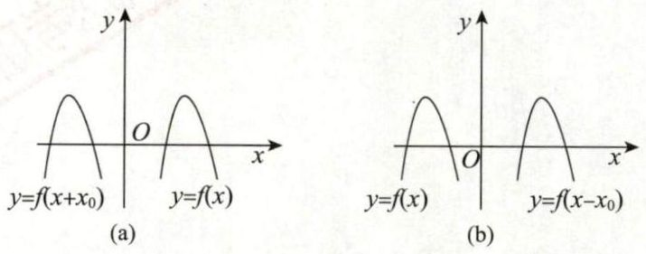

图 1

② 将函数 $ y = f\left( x\right) $ 的图像沿 $ y $ 轴向上平移 $ {y}_{0}\left( {{y}_{0} > 0}\right) $ 个单位长度,得到函数 $ y = f\left( x\right)  + {y}_{0} $ 的图像 [见图 2(a)]; 将函数 $ y = f\left( x\right) $ 的图像沿 $ y $ 轴向下平移 $ {y}_{0}\left( {{y}_{0} > 0}\right) $ 个单位长度,得到函数 $ y = f\left( x\right)  - {y}_{0} $ 的图像 $ \lbrack $ 见图 2(b)].

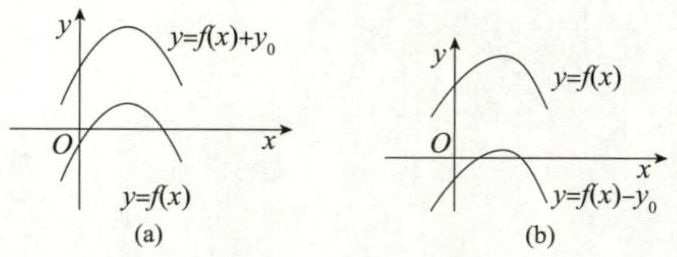

图 2

### (2) 对称变换

① 将函数 $ y = f\left( x\right) $ 的图像关于 $ x $ 轴对称,得到函数 $ y =  - f\left( x\right) $ 的图像 [见图 3(a)].

② 将函数 $ y = f\left( x\right) $ 的图像关于 $ y $ 轴对称,得到函数 $ y = f\left( {-x}\right) $ 的图像 [见图 3(b)].

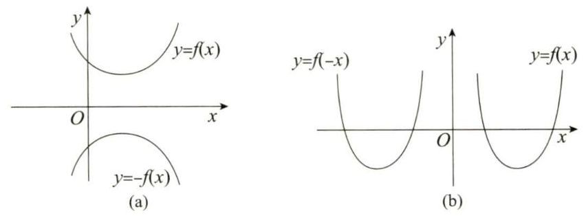

图 3

③ 将函数 $ y = f\left( x\right) $ 的图像关于原点对称,得到函数 $ y =  - f\left( {-x}\right) $ 的图像 [见图 4(a)].

④ 将函数 $ y = f\left( x\right) $ 的图像关于直线 $ y = x $ 对称,得到函数 $ y = {f}^{-1}\left( x\right) $ 的图像 [见图 4(b)].

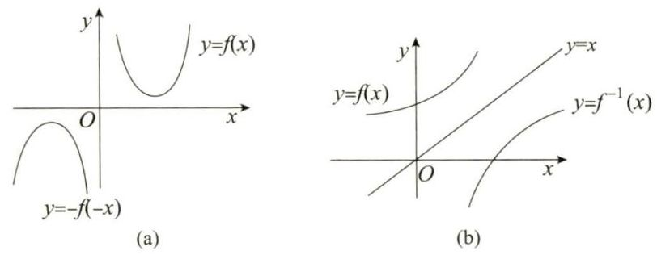

图 4

⑤ 保留函数 $ y = f\left( x\right) $ 在 $ x $ 轴上方的部分,把 $ x $ 轴下方的部分关于 $ x $ 轴对称到 $ x $ 轴上方并去掉原来下方的部分,得到函数 $ y = \left| {f\left( x\right) }\right| $ 的图像 [见图 5(a)].

⑥ 保留函数 $ y = f\left( x\right) $ 在 $ y $ 轴及 $ y $ 轴右侧的部分,去掉 $ y $ 轴左侧的部分,再将 $ y $ 轴右侧图像关于 $ y $ 轴对称到 $ y $ 轴左侧,得到函数 $ y = f\left( \left| x\right| \right) $ 的图像 [见图 5(b)].

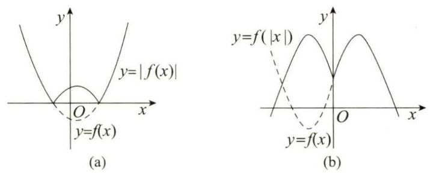

图 5

---

【注】 $ y = f\left( x\right)  \Rightarrow  F\left( {x, y}\right)  = f\left( x\right)  - y = 0 $

① 若 $ F\left( {x, y}\right)  = F\left( {-x, y}\right) $ ,则 $ y = f\left( x\right) $ 关于 $ y $ 轴对称.

② 若 $ F\left( {x, y}\right)  = F\left( {{2T} - x, y}\right) $ 或 $ F\left( {T + x, y}\right)  = F\left( {T - x, y}\right) $ ,则 $ y = f\left( x\right) $ 关于 $ x = T $ 对称.

③ 若 $ F\left( {x, y}\right)  = F\left( {x, - y}\right) $ ,则 $ y = f\left( x\right) $ 关于 $ x $ 轴对称.

④ 若 $ F\left( {x, y}\right)  = F\left( {x,{2T} - y}\right) $ 或 $ F\left( {x, T + y}\right)  = F\left( {x, T - y}\right) $ ,则 $ y = f\left( x\right) $ 关于 $ y = T $ 对称.

⑤ 若 $ F\left( {x, y}\right)  = F\left( {-x, - y}\right) $ ,则 $ y = f\left( x\right) $ 关于(0,0)点对称.

⑥ 若 $ F\left( {a + x, y}\right)  = F\left( {a - x, - y}\right) $ ,则 $ y = f\left( x\right) $ 关于(a,0)点对称.

⑦ 若 $ F\left( {x, y}\right)  = F\left( {y, x}\right) $ ,则 $ y = f\left( x\right) $ 关于 $ y = x $ 对称.

以上结论中, ②, ④, ⑥分别是①, ③, ⑤的更一般结论, 将原对称性进行 “平移”, 要重视.

如

- ${y}^{2} = {x}^{3} - {x}^{4}$ ：关于 $ x $ 轴对称
- ${y}^{2} = {\left( 1 - {x}^{2}\right) }^{3}$ ：关于 $ x $ 轴, $ y $ 轴,(0,0) 点对称
- ${x}^{3} + {y}^{3} - {3xy} = 0$ ：关于 $y = x$ 对称
- $\left\{  \begin{array}{l} x = t - \sin t \\  y = 1 - \cos t \end{array}\right.$ ：关于 $ x = \pi $ 对称。

> $\left\{  {\begin{array}{l} {x}_{2} = \left( {{2\pi } - t}\right)  - \sin \left( {{2\pi } - t}\right)  = {2\pi } - \left( {t - \sin t}\right)  = {2\pi } - {x}_{1}, \\  {y}_{2} = 1 - \cos \left( {{2\pi } - t}\right)  = 1 - \cos t = {y}_{1}, \end{array}\text{ 即 }F\left( {{x}_{1},{y}_{1}}\right)  = F\left( {{2\pi } - {x}_{1},{y}_{1}}\right) .}\right.$

---

### (3) 伸缩变换

① 水平伸缩: $ y = f\left( {kx}\right) \left( {k > 1}\right) $ 的图像,可由 $ y = f\left( x\right) $ 的图像上每点的横坐标缩短到原来的 $ \frac{1}{k} $ 倍且纵坐标不变得到 [见图 6(a)]; $ y = f\left( {kx}\right) \left( {0 < k < 1}\right) $ 的图像,可由 $ y = f\left( x\right) $ 的图像上每点的横坐标伸长到原来的 $ \frac{1}{k} $ 倍且纵坐标不变得到.

②垂直伸缩: $ y = {kf}\left( x\right) \left( {k > 1}\right) $ 的图像,可由 $ y = f\left( x\right) $ 的图像上每点的纵坐标伸长到原来的 $ k $ 倍且横坐标不变得到 [见图 6(b)]; $ y = {kf}\left( x\right) \left( {0 < k < 1}\right) $ 的图像,可由 $ y = f\left( x\right) $ 的图像上每点的纵坐标缩短到原来的 $ k $ 倍且横坐标不变得到.

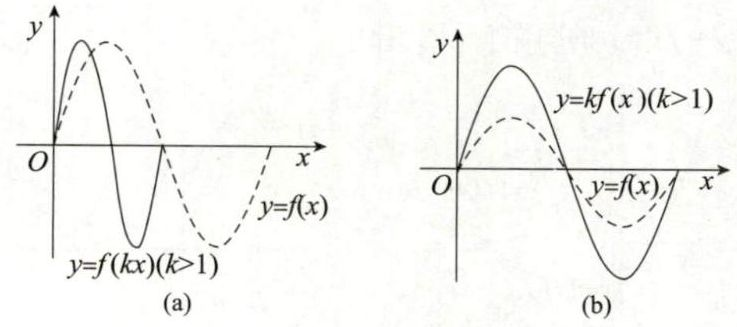

图 6

## 附录2 常用平面图形

(1) 心形线 (外摆线的一种)

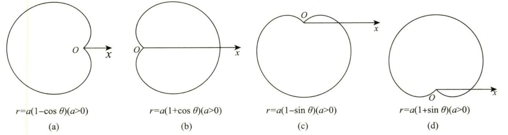

(2) 伯努利双纽线

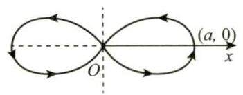

$r^2=a^2\cos 2\theta$ ( $a>0$ )

(a)

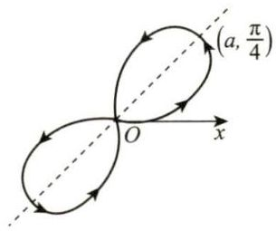

$r^2=a^2\sin 2\theta$ ( $a>0$ )

(b)

(3) 阿基米德螺线

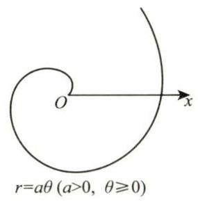

(4) 对数螺线

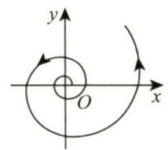

$r=e^{a \theta}$ ( $a>0$ )

(5) 双曲螺线

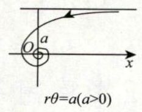

(6) 三叶玫瑰线

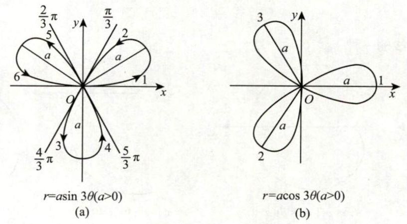

(7) 四叶玫瑰线

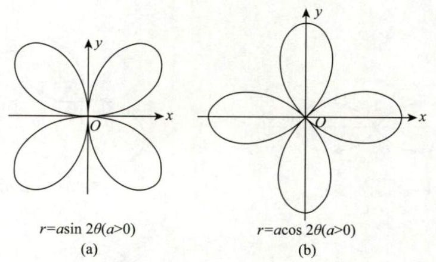

(8) 摆线 (平摆线)

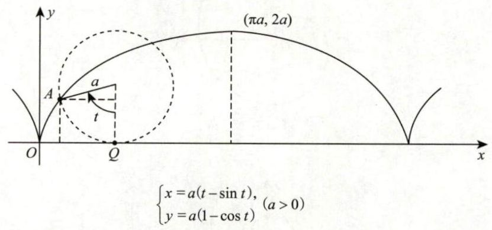

(9) 星形线 (内摆线的一种).

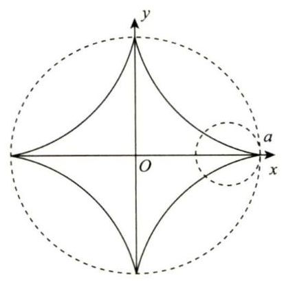

$$
\left\{  \begin{array}{l} x = a{\cos }^{3}t, \\  y = a{\sin }^{3}t \end{array}\right. \text{或}{x}^{\frac{2}{3}} + {y}^{\frac{2}{3}} = {a}^{\frac{2}{3}}\left( {a > 0}\right)
$$

(10) 笛卡尔叶形线

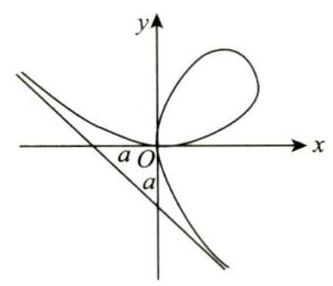

$ {x}^{3} + {y}^{3} - {3axy} = 0 $ 或 $ \left\{  {\begin{array}{l}\displaystyle x = \frac{3at}{1 + {t}^{3}}, \\\\ \displaystyle y = \frac{{3a}{t}^{2}}{1 + {t}^{3}} \end{array}\left( {a > 0}\right) }\right. $

## 附录 3 常用空间图形

### (1)

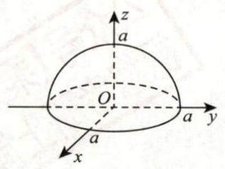

$$
z = \sqrt{{a}^{2} - {x}^{2} - {y}^{2}}, a > 0
$$

### (2)

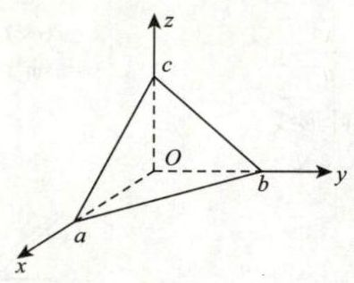

$$
\frac{x}{a} + \frac{y}{b} + \frac{z}{c} = 1, a, b, c > 0,
$$

$$
x, y, z \geq  0
$$

### (3)

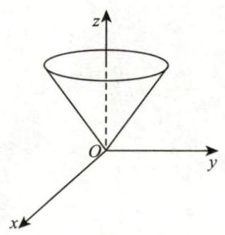

$$
z=\sqrt{x^2+y^2}
$$

### (4)

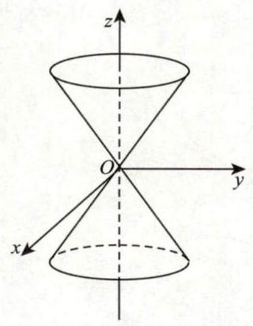

$$
{x}^{2} + {y}^{2} = {z}^{2}
$$

### (5)

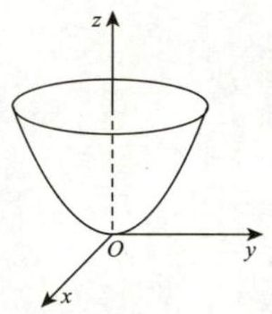

$$
z = {x}^{2} + {y}^{2}
$$

### (6)

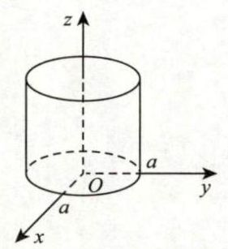

$$
x^2+y^2=a^2, z \ge 0, a > 0
$$

### (7)

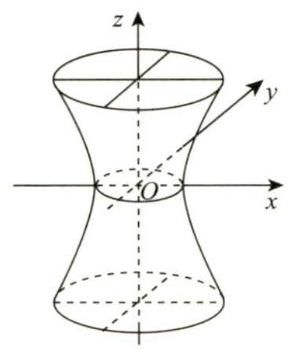

$$
\frac{{x}^{2}}{{a}^{2}} + \frac{{y}^{2}}{{b}^{2}} - \frac{{z}^{2}}{{c}^{2}} = 1
$$

### (8)

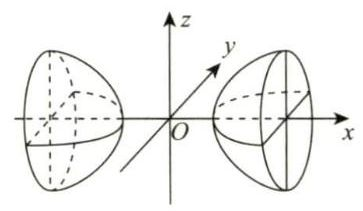

$$
\frac{{x}^{2}}{{a}^{2}} - \frac{{y}^{2}}{{b}^{2}} - \frac{{z}^{2}}{{c}^{2}} = 1
$$

### (9)

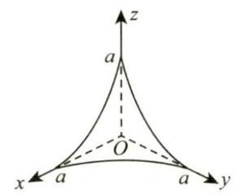

$$
\sqrt{x} + \sqrt{y} + \sqrt{z} = \sqrt{a}, a > 0
$$

### (10)

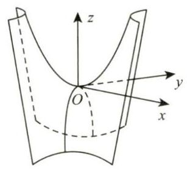

$$
z = {xy}
$$

### (11)

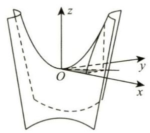

$$
\left\{  \begin{array}{l} z = {xy} \\  y = x \\  x = 1 \\  z = 0 \end{array}\right.
$$

### (12)

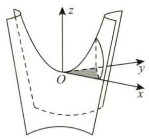

$$
\left\{  \begin{array}{l} z = {xy} \\  x + y = 1 \\  z = 0 \end{array}\right.
$$

### (13)

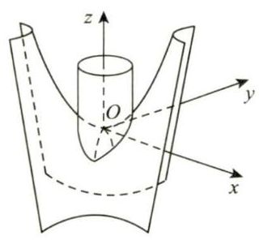

$$
\left\{  \begin{array}{l} z = {xy} \\  {x}^{2} + {y}^{2} = {a}^{2}\left( {a > 0}\right)  \end{array}\right.
$$

### (14)

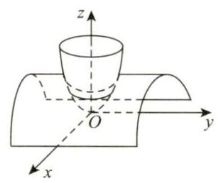

$$
\left\{  \begin{array}{l} z = {x}^{2} + {y}^{2} \\  z = 1 - {x}^{2} \end{array}\right.
$$

### (15)

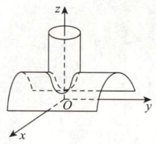

$$
\left\{  \begin{array}{l} {x}^{2} + {y}^{2} = 1 \\  z = 1 - {x}^{2} \end{array}\right.
$$

### (16)

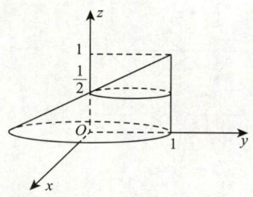

$$
{x}^{2} + {\left( y - z\right) }^{2} = {\left( 1 - z\right) }^{2},0 \leq  z \leq  1
$$

### (17)

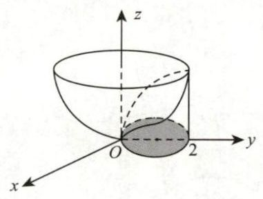

$$
\left\{  \begin{array}{l} z = {x}^{2} + {y}^{2} \\  {x}^{2} + {\left( y - 1\right) }^{2} = 1 \end{array}\right.
$$

### (18)

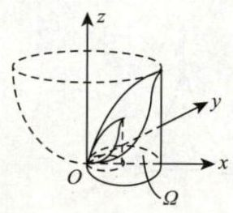

$$
\left\{
\begin{array}{l}
z = 2({x}^{2} + {y}^{2}) \\
{x}^{2}+y^2=x \\
{x}^{2}+y^2=2x \\
z=0
\end{array}\right.
$$

## 附录4 重要公式

### 1. 三角函数常用公式

小结: $ \left\{  \begin{array}{l} \sin \left( {\frac{\pi }{2} \pm  \alpha }\right)  = \cos \alpha , \\  \sin \left( {\pi  \pm  \alpha }\right)  =  \mp  \sin \alpha , \\  \cos \left( {\frac{\pi }{2} \pm  \alpha }\right)  =  \mp  \sin \alpha , \\  \cos \left( {\pi  \pm  \alpha }\right)  =  - \cos \alpha , \end{array}\right. $

#### (1) 诱导公式

<table><thead><tr><th>

函数 \ 角 $ \theta $ </th><th>$ \frac{\pi }{2} - \alpha $</th><th>$ \frac{\pi }{2} + \alpha $</th><th>$ \pi  - \alpha $</th><th>$ \pi  + \alpha $</th><th>$ \frac{3\pi }{2} - \alpha $</th><th>$ \frac{3\pi }{2} + \alpha $</th><th>$ {2\pi } - \alpha $</th></tr></thead><tr><td>$ \sin \theta $</td><td>$ \cos \alpha $</td><td>$ \cos \alpha $</td><td>$ \sin \alpha $</td><td>$ - \sin \alpha $</td><td>$ - \cos \alpha $</td><td>$ - \cos \alpha $</td><td>$ - \sin \alpha $</td></tr><tr><td>$ \cos \theta $</td><td>$ \sin \alpha $</td><td>$ - \sin \alpha $</td><td>$ - \cos \alpha $</td><td>$ - \cos \alpha $</td><td>$ - \sin \alpha $</td><td>$ \sin \alpha $</td><td>$ \cos \alpha $</td></tr><tr><td>$ \tan \theta $</td><td>$ \cot \alpha $</td><td>$ - \cot \alpha $</td><td>$ - \tan \alpha $</td><td>$ \tan \alpha $</td><td>$ \cot \alpha $</td><td>$ - \cot \alpha $</td><td>$ - \tan \alpha $</td></tr><tr><td>$ \cot \theta $</td><td>$ \tan \alpha $</td><td>$ - \tan \alpha $</td><td>$ - \cot \alpha $</td><td>$ \cot \alpha $</td><td>$ \tan \alpha $</td><td>$ - \tan \alpha $</td><td>$ - \cot \alpha $</td></tr></table>

---

【注】(1) 如上表所示,奇变偶不变,符号看象限 (因任一角度均可表示为 $ \frac{k\pi }{2} + \alpha , k \in  \mathbf{Z},\left| \alpha \right|  \leq  \frac{\pi }{4} $ , 故 $ k $ 为奇数时得角 $ \alpha $ 的异名函数值, $ k $ 为偶数时得角 $ \alpha $ 的同名函数值,然后在前面加上一个把角 $ \alpha $ 看成锐角时原来函数值的符号).

(2) 三角函数在四个象限中的符号如下表所示.

<table><thead><tr><th>

函数 \ 角 $ \theta $ 所在象限 </th><th>第一象限</th><th>第二象限</th><th>第三象限</th><th>第四象限</th></tr></thead><tr><td>$ \sin \theta $</td><td>+</td><td>+</td><td>-</td><td>-</td></tr><tr><td>$ \cos \theta $</td><td>+</td><td>-</td><td>-</td><td>+</td></tr><tr><td>$ \tan \theta $</td><td>+</td><td>-</td><td>+</td><td>-</td></tr><tr><td>$ \cot \theta $</td><td>+</td><td>-</td><td>+</td><td>-</td></tr></table>

(3) $\sec \alpha$ 和 $\csc \alpha$ 的函数值可由 $\frac{1}{\cos \alpha }$ 和 $\frac{1}{\sin \alpha }$ 得出.

---

#### (2) 倍角公式

$$
\sin {2\alpha } = 2\sin \alpha \cos \alpha ,\cos {2\alpha } = {\cos }^{2}\alpha  - {\sin }^{2}\alpha  = 1 - 2{\sin }^{2}\alpha  = 2{\cos }^{2}\alpha  - 1,
$$

$$
\sin {3\alpha } =  - 4{\sin }^{3}\alpha  + 3\sin \alpha ,\cos {3\alpha } = 4{\cos }^{3}\alpha  - 3\cos \alpha ,
$$

$$
\tan {2\alpha } = \frac{2\tan \alpha }{1 - {\tan }^{2}\alpha },\cot {2\alpha } = \frac{{\cot }^{2}\alpha  - 1}{2\cot \alpha }.
$$

#### (3) 半角公式

$$
{\sin }^{2}\frac{\alpha }{2} = \frac{1}{2}\left( {1 - \cos \alpha }\right) ,{\cos }^{2}\frac{\alpha }{2} = \frac{1}{2}\left( {1 + \cos \alpha }\right) ,\left( \text{ 降幂公式 }\right)
$$

$$
\sin \frac{\alpha }{2} =  \pm  \sqrt{\frac{1 - \cos \alpha }{2}},\cos \frac{\alpha }{2} =  \pm  \sqrt{\frac{1 + \cos \alpha }{2}},
$$

$$
\tan \frac{\alpha }{2} = \frac{1 - \cos \alpha }{\sin \alpha } = \frac{\sin \alpha }{1 + \cos \alpha } =  \pm  \sqrt{\frac{1 - \cos \alpha }{1 + \cos \alpha }},
$$

$$
\cot \frac{\alpha }{2} = \frac{\sin \alpha }{1 - \cos \alpha } = \frac{1 + \cos \alpha }{\sin \alpha } =  \pm  \sqrt{\frac{1 + \cos \alpha }{1 - \cos \alpha }}.
$$

#### (4) 和差公式

$$
\sin \left( {\alpha  \pm  \beta }\right)  = \sin \alpha \cos \beta  \pm  \cos \alpha \sin \beta ,\cos \left( {\alpha  \pm  \beta }\right)  = \cos \alpha \cos \beta  \mp  \sin \alpha \sin \beta ,
$$

$$
\tan \left( {\alpha  \pm  \beta }\right)  = \frac{\tan \alpha  \pm  \tan \beta }{1 \mp  \tan \alpha \tan \beta },\cot \left( {\alpha  \pm  \beta }\right)  = \frac{\cot \alpha \cot \beta  \mp  1}{\cot \beta  \pm  \cot \alpha }.
$$

#### (5) 积化和差与和差化积公式

① 积化和差公式.

$$
\sin \alpha \cos \beta  = \frac{1}{2}\left\lbrack  {\sin \left( {\alpha  + \beta }\right)  + \sin \left( {\alpha  - \beta }\right) }\right\rbrack  ,\cos \alpha \sin \beta  = \frac{1}{2}\left\lbrack  {\sin \left( {\alpha  + \beta }\right)  - \sin \left( {\alpha  - \beta }\right) }\right\rbrack  ,
$$

$$
\cos \alpha \cos \beta  = \frac{1}{2}\left\lbrack  {\cos \left( {\alpha  + \beta }\right)  + \cos \left( {\alpha  - \beta }\right) }\right\rbrack  ,\sin \alpha \sin \beta  = \frac{1}{2}\left\lbrack  {\cos \left( {\alpha  - \beta }\right)  - \cos \left( {\alpha  + \beta }\right) }\right\rbrack  .
$$

② 和差化积公式.

$$
\sin \alpha  + \sin \beta  = 2\sin \frac{\alpha  + \beta }{2}\cos \frac{\alpha  - \beta }{2},\sin \alpha  - \sin \beta  = 2\sin \frac{\alpha  - \beta }{2}\cos \frac{\alpha  + \beta }{2},
$$

$$
\cos \alpha  + \cos \beta  = 2\cos \frac{\alpha  + \beta }{2}\cos \frac{\alpha  - \beta }{2},\cos \alpha  - \cos \beta  =  - 2\sin \frac{\alpha  + \beta }{2}\sin \frac{\alpha  - \beta }{2}.
$$

#### (6) 万能公式

若 $ u = \tan \frac{x}{2}\left( {-\pi  < x < \pi }\right) $ ,则 $ \sin x = \frac{2u}{1 + {u}^{2}},\cos x = \frac{1 - {u}^{2}}{1 + {u}^{2}} $ .

### 2. 一元二次方程基础

①一元二次方程 $ a{x}^{2} + {bx} + c = 0\left( {a \neq  0}\right) $ .

② 判别式 $ \Delta  = {b}^{2} - {4ac} $ .

$ \Delta  \geq  0 $ ,方程有两个实根 $ {x}_{1,2} = \frac{-b \pm  \sqrt{{b}^{2} - {4ac}}}{2a};\Delta  < 0 $ ,方程有两个共轭的复根 $ {x}_{1,2} = \frac{-b \pm  \sqrt{{4ac} - {b}^{2}}\mathrm{i}}{2a} $ .

③ 根与系数的关系 (韦达定理) $ {x}_{1} + {x}_{2} =  - \frac{b}{a},{x}_{1}{x}_{2} = \frac{c}{a} $ . 

### 3. 因式分解公式

① $ {\left( a + b\right) }^{2} = {a}^{2} + {2ab} + {b}^{2} $ . ② $ {\left( a - b\right) }^{2} = {a}^{2} - {2ab} + {b}^{2} $ .

③ $ {\left( a + b\right) }^{3} = {a}^{3} + 3{a}^{2}b + {3a}{b}^{2} + {b}^{3} $ . ④ $ {\left( a - b\right) }^{3} = {a}^{3} - 3{a}^{2}b + {3a}{b}^{2} - {b}^{3} $ .

⑤ $ {a}^{2} - {b}^{2} = \left( {a + b}\right) \left( {a - b}\right) $ . ⑥ $ {a}^{3} - {b}^{3} = \left( {a - b}\right) \left( {{a}^{2} + {ab} + {b}^{2}}\right) $ .

⑦ $ {a}^{3} + {b}^{3} = \left( {a + b}\right) \left( {{a}^{2} - {ab} + {b}^{2}}\right) $ .

⑧ $ {a}^{n} - {b}^{n} = \left( {a - b}\right) \left( {{a}^{n - 1} + {a}^{n - 2}b + \cdots  + a{b}^{n - 2} + {b}^{n - 1}}\right) \left( {n\text{是正整数}}\right) $ .

⑨ $ n $ 为正奇数时, $ {a}^{n} + {b}^{n} = \left( {a + b}\right) \left( {{a}^{n - 1} - {a}^{n - 2}b + \cdots  - a{b}^{n - 2} + {b}^{n - 1}}\right) $ .

⑩二项式定理

$\displaystyle{\left( a + b\right) }^{n} = \mathop{\sum }\limits_{{k = 0}}^{n}{\mathrm{C}}_{n}^{k}{a}^{n - k}{b}^{k} = {a}^{n} + n{a}^{n - 1}b + \frac{n\left( {n - 1}\right) }{2!}{a}^{n - 2}{b}^{2} + \cdots  + \frac{n\left( {n - 1}\right) \cdots \left( {n - k + 1}\right) }{k!}{a}^{n - k}{b}^{k} + \cdots  + {na}{b}^{n - 1} + {b}^{n}.$

### 4. 阶乘与双阶乘

① $ n! = 1 \cdot  2 \cdot  3 \cdot  \cdots  \cdot  n $ ,规定 $ 0! = 1 $ .

② $ \left( {2n}\right) !! = 2 \cdot  4 \cdot  6 \cdot  \cdots  \cdot  \left( {2n}\right)  = {2}^{n} \cdot  n! $ .

③ $ \left( {{2n} - 1}\right) !! = 1 \cdot  3 \cdot  5 \cdot  \cdots  \cdot  \left( {{2n} - 1}\right) $ .
